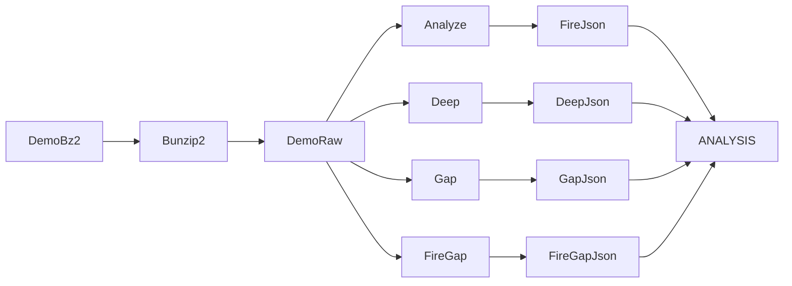

# reversing


**[EN](#english) · [RU / Русский](#русский)**

---

## English

### Overview
Reverse-engineering research corpus. Two artefacts: a coverage tracker for the
FVA (`FuckVacAgain.dll`) port atlas, and a CS2 demo parsing workflow that
cross-checks the VacLiveBypass port against observed server-side behaviour.
No source builds here — inputs for other subprojects.

### Files
| File                                    | Purpose                                                |
|-----------------------------------------|--------------------------------------------------------|
| `PORT_ATLAS_COVERAGE.md`                | Auto-generated FVA port-status index (222 functions)   |
| `demo_analysis/ANALYSIS.md`             | ItzJuego demo — findings + VLB gap sweep               |
| `demo_analysis/CONCLUSION.md`           | Short verdict summary                                  |
| `demo_analysis/itzjuego_de_overpass.dem.bz2` | Source demo, `de_overpass`, patch 14169, 26618 ticks |
| `demo_analysis/analyze_itzjuego.py`     | First-pass parser (fire ticks + weapon)                |
| `demo_analysis/deep_analysis.py`        | Prior/fire/post view-angle snapshot                    |
| `demo_analysis/gap_analysis.py`         | m_nTickBase discontinuity + waitForNoAttack scan       |
| `demo_analysis/fire_gap_hunter.py`      | Double-tap timing detector                             |
| `demo_analysis/fire_pattern.{md,json}`  | Fire-tick pattern report                               |
| `demo_analysis/deep_pattern.{md,json}`  | Pitch/yaw delta report                                 |
| `demo_analysis/gap_pattern.{md,json}`   | tick-gap + attack-gate report                          |
| `demo_analysis/fire_gap_hunter.{md,json}` | Weapon-cooldown violation report                     |

### Build
No build target. Demo parsers run standalone.

```powershell
python -m pip install demoparser2
bunzip2 -kc demo_analysis\itzjuego_de_overpass.dem.bz2 > demo_analysis\itzjuego_de_overpass.dem
python demo_analysis\analyze_itzjuego.py
python demo_analysis\deep_analysis.py
python demo_analysis\gap_analysis.py
python demo_analysis\fire_gap_hunter.py
```

### Runtime
Port atlas status legend used across `PORT_ATLAS_COVERAGE.md`:

| Status                | Meaning                                                 |
|-----------------------|---------------------------------------------------------|
| `matches`             | Ported 1:1, verified byte-equivalent behaviour          |
| `minor_diff`          | Ported, non-load-bearing divergence                     |
| `not_ported`          | Identified, not yet reimplemented                       |
| `n/a_out_of_scope`    | Third-party (fmt, MSVC STL, protoc) — skip             |
| `not_a_function`      | Mid-block address, no function head                     |
| `(unset)`             | Function catalogued, status not filled in               |

Key observations from `demo_analysis/ANALYSIS.md`:

| Metric                          |          Value | Note                                    |
|---------------------------------|---------------:|-----------------------------------------|
| Total fires observed            |           `20` | revolver + ssg08 + awp                  |
| Double-tap pairs (ssg08)        |            `5` | Δ ranges 1..8 ticks (15.6..125 ms)      |
| Fire-tick pitch clamp           |       `179.0°` | 12 of 20 fires                          |
| Fire-tick pitch near-clamp      |     `177..179` | 4 of 20 fires                           |
| Fire-tick pitch partial         |     `163..171` | 3 of 20 fires                           |
| Yaw variance on fire            |          `±1°` | not yaw-AA                              |
| m_bWaitForNoAttack transitions  |         `200+` | client ignores gate, server flips back  |
| m_nTickBase gaps (Δ ≥ 2)        |           `10` | over 26618 ticks                        |
| m_arrForceSubtickMoveWhen       |          `0.0` | Valve API unused, spoof via input_history |

### Architecture


<details>
<summary>Port atlas — status counts</summary>

Numbers reflect the current `PORT_ATLAS_COVERAGE.md` snapshot (222 rows total).
Rerun the atlas generator to refresh; do not hand-edit the tracker.

</details>

### Constraints
- Depot compatibility: demo captured on patch `14169`; VLB targets `14167` and
  `24134959`. RVAs in the port atlas refer to the FVA rebuild image, not to
  `client.dll`.
- Anti-cheat scope: research on VAC-observable behaviour only. Never run against
  live Valve servers.
- Demo parsing needs `demoparser2` (Python 3.10+) and `bunzip2` on PATH.
- `m_angEyeAngles` in the demo is server post-apply state, not raw client input;
  interpret pitch clamp as a consequence of VLB emission, not as a gap.
- Research / education / bug-bounty use only.

---

## Русский

### Обзор
Корпус reverse-engineering материалов. Два артефакта: coverage tracker для port
atlas FVA (`FuckVacAgain.dll`) и workflow разбора CS2 demo, сверяющий VacLiveBypass
port с наблюдаемым server-side поведением. Здесь нет собираемых бинарей — только
входные данные для других подпроектов.

### Файлы
| Файл                                     | Назначение                                            |
|------------------------------------------|-------------------------------------------------------|
| `PORT_ATLAS_COVERAGE.md`                 | Авто-сгенерированный индекс порта FVA (222 функции)   |
| `demo_analysis/ANALYSIS.md`              | Демо ItzJuego — findings + gap-sweep VLB              |
| `demo_analysis/CONCLUSION.md`            | Короткий итог                                         |
| `demo_analysis/itzjuego_de_overpass.dem.bz2` | Исходная демка, `de_overpass`, patch 14169, 26618 tick |
| `demo_analysis/analyze_itzjuego.py`      | Первый проход (fire ticks + оружие)                   |
| `demo_analysis/deep_analysis.py`         | Snapshot prior/fire/post view-angle                   |
| `demo_analysis/gap_analysis.py`          | Скан m_nTickBase gap + waitForNoAttack                |
| `demo_analysis/fire_gap_hunter.py`       | Детектор double-tap по cooldown                       |
| `demo_analysis/fire_pattern.{md,json}`   | Отчёт по fire-tick pattern                            |
| `demo_analysis/deep_pattern.{md,json}`   | Отчёт по pitch/yaw delta                              |
| `demo_analysis/gap_pattern.{md,json}`    | Отчёт по tick-gap + attack-gate                       |
| `demo_analysis/fire_gap_hunter.{md,json}` | Отчёт по нарушениям weapon-cooldown                  |

### Сборка
Нет цели сборки. Демо-парсеры запускаются standalone.

```powershell
python -m pip install demoparser2
bunzip2 -kc demo_analysis\itzjuego_de_overpass.dem.bz2 > demo_analysis\itzjuego_de_overpass.dem
python demo_analysis\analyze_itzjuego.py
python demo_analysis\deep_analysis.py
python demo_analysis\gap_analysis.py
python demo_analysis\fire_gap_hunter.py
```

### Runtime
Легенда статусов port atlas в `PORT_ATLAS_COVERAGE.md`:

| Статус                | Значение                                                |
|-----------------------|---------------------------------------------------------|
| `matches`             | Портировано 1:1, byte-equivalent проверено              |
| `minor_diff`          | Портировано, non-load-bearing расхождение               |
| `not_ported`          | Определено, не переписано                               |
| `n/a_out_of_scope`    | Third-party (fmt, MSVC STL, protoc) — пропуск           |
| `not_a_function`      | Mid-block адрес, не голова функции                      |
| `(unset)`             | Функция каталогизирована, статус не заполнен            |

Ключевые observations из `demo_analysis/ANALYSIS.md`:

| Метрика                          |        Значение | Заметка                                    |
|----------------------------------|----------------:|--------------------------------------------|
| Всего выстрелов                  |            `20` | revolver + ssg08 + awp                     |
| Double-tap пар (ssg08)           |             `5` | Δ 1..8 tick (15.6..125 ms)                 |
| Pitch clamp на fire tick         |        `179.0°` | 12 из 20                                   |
| Pitch near-clamp на fire tick    |      `177..179` | 4 из 20                                    |
| Pitch partial на fire tick       |      `163..171` | 3 из 20                                    |
| Разброс yaw на fire              |           `±1°` | не yaw-AA                                  |
| Транзиций m_bWaitForNoAttack     |          `200+` | client игнорит gate, server flip'ает       |
| m_nTickBase gap (Δ ≥ 2)          |            `10` | на 26618 tick                              |
| m_arrForceSubtickMoveWhen        |           `0.0` | Valve API не используется, spoof через input_history |

### Архитектура


<details>
<summary>Port atlas — счётчики статусов</summary>

Числа отражают текущий snapshot `PORT_ATLAS_COVERAGE.md` (всего 222 строк).
Для обновления перезапустить генератор атласа; ручных правок в трекер не вносить.

</details>

### Ограничения
- Depot compatibility: demo снята на patch `14169`; VLB таргетирует `14167` и
  `24134959`. RVA в port atlas относятся к rebuild-образу FVA, не к `client.dll`.
- Anti-cheat scope: research на VAC-наблюдаемом поведении. Не запускать против
  живых серверов Valve.
- Демо-парсинг требует `demoparser2` (Python 3.10+) и `bunzip2` в PATH.
- `m_angEyeAngles` в demo — server post-apply state, не raw client input; pitch
  clamp интерпретируется как следствие эмита VLB, а не как gap.
- Research / education / bug-bounty. Не для боевых серверов Valve.
