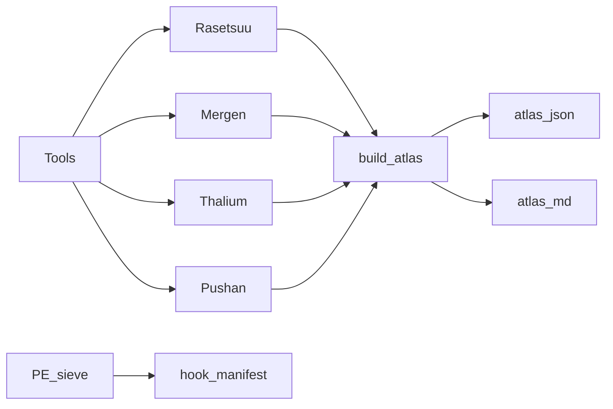

# vmp_atlas


**[EN](#english) · [RU / Русский](#русский)**

---

## English

### Overview
Consolidated VMProtect handler atlas for `FuckVacV2.dll` plus a live hook manifest captured from a running `cs2.exe`. `build_atlas.py` merges output from 16 devirt tools into `atlas.json` and prints `atlas.md`. `hook_manifest.json` is the PE-sieve dump of 108 inline hooks installed by the FVA loader.

### Files
| File                 | Purpose                                            |
|----------------------|----------------------------------------------------|
| `build_atlas.py`     | Merger — 16 tool outputs into atlas.json + atlas.md |
| `atlas.json`         | Machine-readable atlas keyed by RVA                |
| `atlas.md`           | Human summary — VMEnters, seeds, next-hops         |
| `hook_manifest.json` | PE-sieve v0.4.1.1 dump — 108 inline hooks in cs2.exe |

### Build
```powershell
py -3 docs/vmp_atlas/build_atlas.py
```

Reads tool outputs under `C:/Users/sshunko/source/repos/tools/` (Rasetsuu, Mergen, t02–t20, devirt_vmprotect3, pushan_proto). Writes `atlas.json` and `atlas.md` next to the script.

### Runtime
Target binary metadata recorded in `atlas.json._meta.target`:

| Field                | Value                                              |
|----------------------|----------------------------------------------------|
| `static_dll`         | `source/dlls/FuckVacV2.dll` (2224128 B)            |
| `dump_dll`           | `source/dlls/FuckVacV2_dump.dll` (4546560 B)       |
| `image_base_dump`    | `0x7FFEBCF90000`                                   |
| `image_base_static`  | `0x180000000`                                      |
| `vmp_version`        | `3.6 - 3.10.5`                                     |

VMP register roles (`_meta.confirmed_facts`):

| Role             | Register |
|------------------|---------:|
| `VIP`            |    `RSI` |
| `VSP`            |    `RBP` |
| `ROLLING_KEY`    |    `RBX` |
| `VMREGs_base`    |    `RDI` |
| `HANDLER_TABLE`  |    `R12` |
| `IMAGEBASE`      |    `R13` |

Known VMEnter seeds hard-coded in the merger:

| VMEnter RVA   | Seed key       |
|---------------|---------------:|
| `0x1AB7E6`    |     `0x80021`  |
| `0x1E1D26`    |  `0x8149C614`  |
| `0x206677`    |  `0x342DAAA1`  |
| `0x211691`    |  `0x20889A18`  |

Live hook manifest — `hook_manifest.json` header:

| Field                  | Value                                        |
|------------------------|----------------------------------------------|
| `main_image`           | `cs2.exe`                                    |
| `fuckvac_base`         | `0x7FFB8D170000`                             |
| `client_dll_base`      | `0x7FFB8EB00000`                             |
| `total_hooks`          | `108`                                        |
| `trampoline_pools`     | 4 pools (3 + 41 + 61 + 3 patches)            |

client.dll target RVAs:

| Slot   | RVA         | Size |
|--------|------------:|-----:|
| `hook_0` | `0xACF190` |  `5` |
| `hook_1` | `0xAFDFB0` |  `5` |
| `hook_2` | `0x1188CB0`|  `5` |

### Architecture


<details>
<summary>Full source tool list</summary>

- `t02_cfg_sig` — push-imm+jmp CFG signature scanner
- `t03_ida_vmp_hunter` — IDA static hunter
- `t04_eversinc33_llvm_devirt` — pseudo-LLVM lifter
- `t06_hackyboiz` — VMP walker
- `t07_hackyboiz_triton` — Triton → LLVM IR handlers
- `t08_ticklingvmp` — trace collector
- `t09_thalium_devirt` — Triton symbolic per-VMEnter
- `t12_oasif` — auxiliary lifter
- `t13_ticklingvmp_part23` — extended trace
- `t18_hadengue` — VMP-3 dispatcher probe
- `t19_0xnobody` — handler classifier
- `t20_vmp_imports` — IAT harvester
- `rasetsuu` (vmprotect-research) — CRC*31 XOR stream decrypter
- `Mergen` — LLVM 18.1.8 lifted output
- `devirt_vmprotect3` — Triton PE-direct loader
- `pushan_proto` — VPC-sensitive flat CFG stage-1

</details>

### Constraints
- Depot scope: FVA build shipped as `FuckVacV2.dll` — RVAs bound to that image.
- Research / education / bug-bounty use only. Never against live Valve servers.
- Cipher confirmed: `CRC*31 XOR` stream (Rasetsuu `src/decrypt.rs::OpcodeCryptor`).
- Shared dispatcher VA `0x7FFEBD34A085` — all 5 devirt'd handlers converge here.
- On-disk section `.#?n` backs everything. `.#I5` is raw=0 in the packed image and only populated by the VMP TLS callback at load time.

---

## Русский

### Обзор
Сводный VMProtect-атлас handlers `FuckVacV2.dll` плюс live hook manifest, снятый с работающего `cs2.exe`. `build_atlas.py` мержит output 16 devirt-инструментов в `atlas.json` и печатает `atlas.md`. `hook_manifest.json` — PE-sieve dump 108 inline hooks, установленных FVA loader'ом.

### Файлы
| Файл                 | Назначение                                          |
|----------------------|-----------------------------------------------------|
| `build_atlas.py`     | Merger — 16 tool outputs в atlas.json + atlas.md    |
| `atlas.json`         | Machine-readable atlas по ключу RVA                 |
| `atlas.md`           | Human summary — VMEnters, seeds, next-hops          |
| `hook_manifest.json` | PE-sieve v0.4.1.1 dump — 108 inline hooks в cs2.exe |

### Сборка
```powershell
py -3 docs/vmp_atlas/build_atlas.py
```

Читает outputs инструментов под `C:/Users/sshunko/source/repos/tools/` (Rasetsuu, Mergen, t02–t20, devirt_vmprotect3, pushan_proto). Пишет `atlas.json` и `atlas.md` рядом со скриптом.

### Runtime
Метаданные target-бинарника в `atlas.json._meta.target`:

| Field                | Value                                              |
|----------------------|----------------------------------------------------|
| `static_dll`         | `source/dlls/FuckVacV2.dll` (2224128 B)            |
| `dump_dll`           | `source/dlls/FuckVacV2_dump.dll` (4546560 B)       |
| `image_base_dump`    | `0x7FFEBCF90000`                                   |
| `image_base_static`  | `0x180000000`                                      |
| `vmp_version`        | `3.6 - 3.10.5`                                     |

VMP register roles (`_meta.confirmed_facts`):

| Role             | Register |
|------------------|---------:|
| `VIP`            |    `RSI` |
| `VSP`            |    `RBP` |
| `ROLLING_KEY`    |    `RBX` |
| `VMREGs_base`    |    `RDI` |
| `HANDLER_TABLE`  |    `R12` |
| `IMAGEBASE`      |    `R13` |

Известные VMEnter seeds, зашитые в merger:

| VMEnter RVA   | Seed key       |
|---------------|---------------:|
| `0x1AB7E6`    |     `0x80021`  |
| `0x1E1D26`    |  `0x8149C614`  |
| `0x206677`    |  `0x342DAAA1`  |
| `0x211691`    |  `0x20889A18`  |

Live hook manifest — заголовок `hook_manifest.json`:

| Field                  | Value                                        |
|------------------------|----------------------------------------------|
| `main_image`           | `cs2.exe`                                    |
| `fuckvac_base`         | `0x7FFB8D170000`                             |
| `client_dll_base`      | `0x7FFB8EB00000`                             |
| `total_hooks`          | `108`                                        |
| `trampoline_pools`     | 4 pools (3 + 41 + 61 + 3 patches)            |

client.dll target RVAs:

| Slot   | RVA         | Size |
|--------|------------:|-----:|
| `hook_0` | `0xACF190` |  `5` |
| `hook_1` | `0xAFDFB0` |  `5` |
| `hook_2` | `0x1188CB0`|  `5` |

### Архитектура


<details>
<summary>Полный список source-инструментов</summary>

- `t02_cfg_sig` — push-imm+jmp CFG signature scanner
- `t03_ida_vmp_hunter` — IDA static hunter
- `t04_eversinc33_llvm_devirt` — pseudo-LLVM lifter
- `t06_hackyboiz` — VMP walker
- `t07_hackyboiz_triton` — Triton → LLVM IR handlers
- `t08_ticklingvmp` — trace collector
- `t09_thalium_devirt` — Triton symbolic per-VMEnter
- `t12_oasif` — auxiliary lifter
- `t13_ticklingvmp_part23` — extended trace
- `t18_hadengue` — VMP-3 dispatcher probe
- `t19_0xnobody` — handler classifier
- `t20_vmp_imports` — IAT harvester
- `rasetsuu` (vmprotect-research) — CRC*31 XOR stream decrypter
- `Mergen` — LLVM 18.1.8 lifted output
- `devirt_vmprotect3` — Triton PE-direct loader
- `pushan_proto` — VPC-sensitive flat CFG stage-1

</details>

### Ограничения
- Depot scope: FVA build поставляется как `FuckVacV2.dll` — RVAs привязаны к этому образу.
- Research / education / bug-bounty. Не для боевых серверов Valve.
- Cipher подтверждён: `CRC*31 XOR` stream (Rasetsuu `src/decrypt.rs::OpcodeCryptor`).
- Shared dispatcher VA `0x7FFEBD34A085` — все 5 devirt'нутых handlers сходятся сюда.
- On-disk section `.#?n` держит содержимое. `.#I5` raw=0 в packed образе и заполняется только VMP TLS callback при load time.
