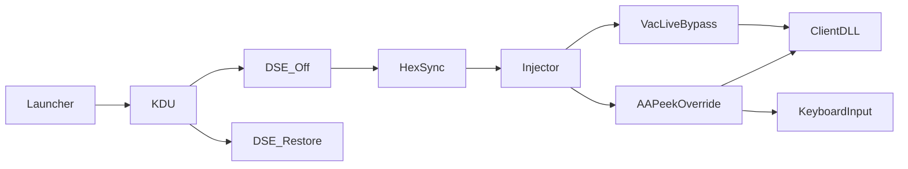
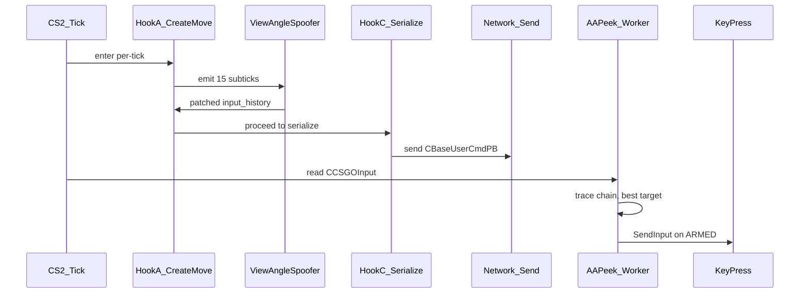

# CS2-P2C-TEMPLATES — Architecture


**[EN](#english) · [RU / Русский](#русский)**

---

## English

### Overview
End-to-end view of how the repo assembles into one live pipeline. A kernel
driver loader disables DSE, a signed vulnerable driver maps the kit driver,
that driver performs kernel-mode DLL injection into `cs2.exe`, and two
payload DLLs then run inside the game to hook `client.dll` and read the
game state. This page indexes the moving parts and shows the per-tick data
flow. Research and bug-bounty use only.

### Files
| File                                                | Purpose                                             |
|-----------------------------------------------------|-----------------------------------------------------|
| `source/dlls/VacLiveBypass/`                        | `fva_recon.dll` — subtick input-history mutator     |
| `source/dlls/AA_PeekOverride/`                      | Trace-based peek assist DLL, local-only             |
| `source/tools/CS2UnifiedInjector/`                  | 11-method injector, kernel-mode path via HexSync    |
| `source/drivers/CS2HexSyncCompatDriver/`            | Kernel injector driver + 9-IOCTL API                |
| `source/drivers/CS2IsValveDSSpooferDriver/`         | `IsValveDS` byte spoofer                            |
| `source/drivers/CS2KillTriggerDriver/`              | PID kill IOCTL                                      |
| `source/drivers/CS2NoclipDriver/`                   | Player-list noclip flag writer                      |
| `source/drivers/CS2RankSpooferDriver/`              | Rank byte spoofer                                   |
| `third_party/KDU/`                                  | Kernel Driver Utility, 65 vulnerable providers      |
| `build/kit_vlb_default/Launch-Inject.bat`         | 12-step launcher, double-click entry                |
| `build/kit_*`                                       | Standalone kits per project                         |

### Build
Payload DLL, both depot targets:

```powershell
cd source\dlls\VacLiveBypass
cmake -B build       -DFVA_TARGET_DEPOT=24134959
cmake --build build       --config Release --target fva_recon
cmake -B build_14167 -DFVA_TARGET_DEPOT=14167
cmake --build build_14167 --config Release --target fva_recon
```

Injector and drivers via the top-level solution:

```powershell
msbuild source\dlls\VacLiveBypass.sln /p:Configuration=Release /p:Platform=x64
```

Kits assemble from `build/kit_*` — the launcher wires them together:

```bat
build\kit_vlb_default\Launch-Inject.bat
```

### Runtime
Load order and role per component:

| Step | Component                    | Ring | Role                                        |
|-----:|------------------------------|------|---------------------------------------------|
|    1 | `Launch-Inject.bat`          | 3    | Orchestrator, UAC elevate                   |
|    2 | KDU                          | 3    | Toggle DSE off via vulnerable provider      |
|    3 | HexSync `.sys`               | 0    | Kernel injector, 9 IOCTLs                   |
|    4 | `CS2UnifiedInjector.exe`     | 3    | Sends IOCTL, kernel-mode DLL inject         |
|    5 | `fva_recon.dll`              | 3    | MinHook detours in `client.dll`             |
|    6 | `AA_PeekOverride.dll`        | 3    | Polling worker + trace chain reads          |
|    7 | KDU                          | 3    | Restore DSE                                 |

MinHook detours installed by `fva_recon.dll`:

| Hook | Symbol                              | RVA (24134959) | RVA (14167)  |
|------|-------------------------------------|---------------:|-------------:|
| A    | `CreateMovePrePrediction`           |    `0x109D8C0` |    `0x10D9D8C` |
| B    | `IGameSystem::LevelInit`            |    `0x1140000` |    `0x1110000` |
| C    | `CBaseUserCmdPB::SerializeToArray`  |    `0x11A0000` |    `0x1170000` |

Direct RVA reads used by `AA_PeekOverride.dll`:

| Symbol                        | RVA           | Notes                          |
|-------------------------------|--------------:|--------------------------------|
| `CCSGOInput` singleton        |    `0x23B95F0` | client.dll `.data`             |
| Entity list stride            |         `0x70` | per player controller entry    |
| Bop32 trace mask              |    `0x1C300B` | penetrates walls, layer 3      |

### Architecture
Module pipeline — kit launcher through into the game process:



Per-tick flow inside `cs2.exe` — from `CreateMove` through wire send and
back into the peek-assist worker:



### Constraints
- Depot targets: `14167` baseline and `24134959` live. New depots require
  RVA re-sync via `scripts/auto_adapt_new_depot.ps1`.
- Windows 10+ x64 only. HVCI must be off for kdmap.
- HexSync driver is in-memory, unload only on reboot.
- VAC scope only. Never against Valve live servers.
- `AA_PeekOverride` is local-only. Do not push to public remotes.
- Research, education, bug-bounty use.

---

## Русский

### Обзор
Сквозной вид того, как репозиторий собирается в один живой pipeline.
Kernel driver loader выключает DSE, подписанный vulnerable driver грузит
kit driver, тот делает kernel-mode DLL инжект в `cs2.exe`, и два payload
DLL внутри игры ставят хуки на `client.dll` и читают game state. Страница
индексирует движущиеся части и показывает per-tick поток данных. Только
research и bug-bounty.

### Файлы
| Файл                                                | Назначение                                          |
|-----------------------------------------------------|-----------------------------------------------------|
| `source/dlls/VacLiveBypass/`                        | `fva_recon.dll` — subtick input-history mutator     |
| `source/dlls/AA_PeekOverride/`                      | Trace-based peek assist DLL, local-only             |
| `source/tools/CS2UnifiedInjector/`                  | 11-method injector, kernel-mode path via HexSync    |
| `source/drivers/CS2HexSyncCompatDriver/`            | Kernel injector driver + 9-IOCTL API                |
| `source/drivers/CS2IsValveDSSpooferDriver/`         | `IsValveDS` byte spoofer                            |
| `source/drivers/CS2KillTriggerDriver/`              | PID kill IOCTL                                      |
| `source/drivers/CS2NoclipDriver/`                   | Player-list noclip flag writer                      |
| `source/drivers/CS2RankSpooferDriver/`              | Rank byte spoofer                                   |
| `third_party/KDU/`                                  | Kernel Driver Utility, 65 vulnerable providers      |
| `build/kit_vlb_default/Launch-Inject.bat`         | 12-step launcher, double-click entry                |
| `build/kit_*`                                       | Standalone kits per project                         |

### Сборка
Payload DLL, обе цели depot:

```powershell
cd source\dlls\VacLiveBypass
cmake -B build       -DFVA_TARGET_DEPOT=24134959
cmake --build build       --config Release --target fva_recon
cmake -B build_14167 -DFVA_TARGET_DEPOT=14167
cmake --build build_14167 --config Release --target fva_recon
```

Injector и драйверы через solution верхнего уровня:

```powershell
msbuild source\dlls\VacLiveBypass.sln /p:Configuration=Release /p:Platform=x64
```

Kits собираются из `build/kit_*` — launcher связывает всё вместе:

```bat
build\kit_vlb_default\Launch-Inject.bat
```

### Runtime
Порядок загрузки и роль каждого компонента:

| Step | Компонент                    | Ring | Роль                                        |
|-----:|------------------------------|------|---------------------------------------------|
|    1 | `Launch-Inject.bat`          | 3    | Оркестратор, UAC elevate                    |
|    2 | KDU                          | 3    | Выключение DSE через vulnerable provider    |
|    3 | HexSync `.sys`               | 0    | Kernel injector, 9 IOCTLs                   |
|    4 | `CS2UnifiedInjector.exe`     | 3    | Отправка IOCTL, kernel-mode DLL инжект      |
|    5 | `fva_recon.dll`              | 3    | MinHook detours в `client.dll`              |
|    6 | `AA_PeekOverride.dll`        | 3    | Polling worker + trace chain reads          |
|    7 | KDU                          | 3    | Восстановление DSE                          |

MinHook detours, устанавливаемые `fva_recon.dll`:

| Hook | Symbol                              | RVA (24134959) | RVA (14167)  |
|------|-------------------------------------|---------------:|-------------:|
| A    | `CreateMovePrePrediction`           |    `0x109D8C0` |    `0x10D9D8C` |
| B    | `IGameSystem::LevelInit`            |    `0x1140000` |    `0x1110000` |
| C    | `CBaseUserCmdPB::SerializeToArray`  |    `0x11A0000` |    `0x1170000` |

Прямые RVA reads, используемые `AA_PeekOverride.dll`:

| Symbol                        | RVA           | Notes                          |
|-------------------------------|--------------:|--------------------------------|
| `CCSGOInput` singleton        |    `0x23B95F0` | client.dll `.data`             |
| Entity list stride            |         `0x70` | per player controller entry    |
| Bop32 trace mask              |    `0x1C300B` | penetrates walls, layer 3      |

### Архитектура
Pipeline модулей — от kit launcher до процесса игры:


Per-tick поток внутри `cs2.exe` — от `CreateMove` через wire send и
обратно в peek-assist worker:


### Ограничения
- Цели depot: `14167` baseline и `24134959` live. Новые depot требуют
  ресинка RVA через `scripts/auto_adapt_new_depot.ps1`.
- Только Windows 10+ x64. HVCI должен быть выключен для kdmap.
- HexSync driver in-memory, выгрузка только при reboot.
- Scope только VAC. Никогда не против боевых серверов Valve.
- `AA_PeekOverride` только локально. Не push на публичные remotes.
- Research, education, bug-bounty.
