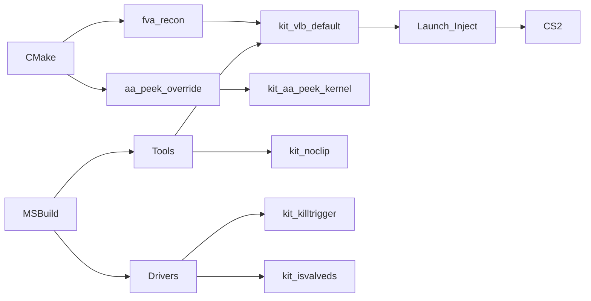
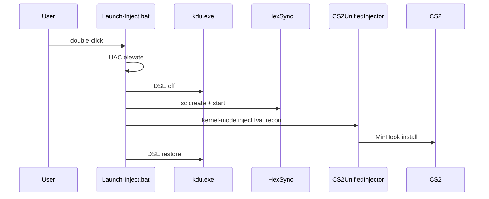

# Build and Deploy


**[EN](#english) · [RU / Русский](#русский)**

---

## English

### Overview
Master build reference for every project in the repository. Covers CMake
presets for the DLL payloads, MSBuild invocations for tools and drivers,
kit deploy paths under `build/`, and the UAC requirements each launcher
enforces. Research and bug-bounty material only.

### Files
| File                                                        | Purpose                                        |
|-------------------------------------------------------------|------------------------------------------------|
| `source/dlls/VacLiveBypass/CMakeLists.txt`                  | fva_recon DLL, depot + gate options            |
| `source/dlls/AA_PeekOverride/CMakeLists.txt`                | aa_peek_override DLL, MinHook vendored         |
| `source/dlls/VacLiveBypass.sln`                             | Umbrella solution for MSBuild                  |
| `source/tools/CS2UnifiedInjector/CS2UnifiedInjector.vcxproj`| 11-method injector, v143 toolset               |
| `source/tools/CS2NoclipTool/CS2NoclipTool.vcxproj`          | NOC3 TUI                                       |
| `source/tools/KernelDriverMapper/KernelDriverMapper.vcxproj`| SCM-based kdmap loader                         |
| `source/tools/KbdClassAnalyzer/KbdClassAnalyzer.vcxproj`    | kbdclass callback RVA resolver                 |
| `source/drivers/CS2HexSyncCompatDriver/*.vcxproj`           | HexSync kernel-mode inject helper              |
| `source/drivers/CS2IsValveDSSpooferDriver/*.vcxproj`        | IsValveDS spoofer                              |
| `source/drivers/CS2KillTriggerDriver/*.vcxproj`             | F20Driver — round_kills watcher                |
| `source/drivers/CS2NoclipDriver/*.vcxproj`                  | NOC3 whitelist driver                          |
| `source/drivers/CS2RankSpooferDriver/*.vcxproj`             | Rank spoofer driver                            |
| `build/kit_*/`                                              | Standalone launcher folders — see Runtime      |

### Build

DLL payloads use CMake presets. Tools and drivers use MSBuild direct.

VacLiveBypass — both depot builds:

```powershell
cd source\dlls\VacLiveBypass
cmake -B build       -DFVA_TARGET_DEPOT=24134959 -DFVA_GATE_MODE=attack
cmake --build build       --config Release --target fva_recon
cmake -B build_14167 -DFVA_TARGET_DEPOT=14167    -DFVA_GATE_MODE=attack
cmake --build build_14167 --config Release --target fva_recon
```

VacLiveBypass — byte gate flavour:

```powershell
cd source\dlls\VacLiveBypass
cmake -B build_byte -DFVA_TARGET_DEPOT=24134959 -DFVA_GATE_MODE=byte
cmake --build build_byte --config Release --target fva_recon
```

AA_PeekOverride:

```powershell
cd source\dlls\AA_PeekOverride
cmake -B build
cmake --build build --config Release --target aa_peek_override
```

Every C++ tool and driver — same shape, run from repo root:

```powershell
msbuild source\tools\CS2UnifiedInjector\CS2UnifiedInjector.vcxproj  /p:Configuration=Release /p:Platform=x64
msbuild source\tools\CS2NoclipTool\CS2NoclipTool.vcxproj            /p:Configuration=Release /p:Platform=x64
msbuild source\tools\CS2MemoryTool\CS2MemoryTool.vcxproj            /p:Configuration=Release /p:Platform=x64
msbuild source\tools\KernelDriverMapper\KernelDriverMapper.vcxproj  /p:Configuration=Release /p:Platform=x64
msbuild source\tools\KernelDriverUnmapper\KernelDriverUnmapper.vcxproj /p:Configuration=Release /p:Platform=x64
msbuild source\tools\KbdClassAnalyzer\KbdClassAnalyzer.vcxproj      /p:Configuration=Release /p:Platform=x64
```

Kernel drivers require the WDK SDK installed alongside the WindowsTargetPlatformVersion `10.0.26100.0`:

```powershell
msbuild source\drivers\CS2HexSyncCompatDriver\CS2HexSyncCompatDriver.vcxproj    /p:Configuration=Release /p:Platform=x64
msbuild source\drivers\CS2IsValveDSSpooferDriver\CS2IsValveDSSpooferDriver.vcxproj /p:Configuration=Release /p:Platform=x64
msbuild source\drivers\CS2KillTriggerDriver\CS2KillTriggerDriver.vcxproj        /p:Configuration=Release /p:Platform=x64
msbuild source\drivers\CS2NoclipDriver\CS2NoclipDriver.vcxproj                  /p:Configuration=Release /p:Platform=x64
msbuild source\drivers\CS2RankSpooferDriver\CS2RankSpooferDriver.vcxproj        /p:Configuration=Release /p:Platform=x64
```

Post-build sync — copy artefacts into their kits before deploy:

```powershell
Copy-Item source\dlls\VacLiveBypass\build\Release\fva_recon.dll `
    build\kit_vlb_default\fva_recon_24134959.dll -Force
Copy-Item source\dlls\VacLiveBypass\build_14167\Release\fva_recon.dll `
    build\kit_vlb_default\fva_recon_14167.dll -Force
Copy-Item source\tools\CS2UnifiedInjector\x64\Release\CS2UnifiedInjector.exe `
    build\kit_vlb_default\CS2UnifiedInjector.exe -Force
```

### Runtime

Kit deploy paths — double-click the loader script per kit. Every loader
elevates via UAC; a Standard user account is rejected.

| Kit folder                        | Loader script          | Payload                                      | UAC |
|-----------------------------------|------------------------|----------------------------------------------|:---:|
| `build/kit_vlb_default/`        | `Launch-Inject.bat`    | HexSync SCM + kernel inject of `fva_recon`   | yes |
| `build/kit_vlb_attack_gated/`               | `Launch-Inject.bat`    | fva_recon attack gate                        | yes |
| `build/kit_vlb_byte_gated/`                 | `Launch-Inject.bat`    | fva_recon byte gate                          | yes |
| `build/kit_aa_peek_kernel/`       | `Launch-V1.bat`/`-V2.bat` | aa_peek_override DLL, kernel-mode inject   | yes |
| `build/kit_isvalveds/`            | `Load-Spoofer.bat`     | IsValveDS spoofer via SCM                    | yes |
| `build/kit_isvalveds/`    | `Launch-Spoofer.bat`   | IsValveDS spoofer via KDU `-map`             | yes |
| `build/kit_killtrigger/`          | `Launch.bat`           | F20Driver + `analyze_kbdclass.exe` + KDU     | yes |
| `build/kit_noclip/`               | `Launch.bat`           | NOC3 driver + colour TUI                     | yes |
| `build/kit_rankspoof/`            | `Load-Spoofer.bat`     | RankSpoofer driver + console                 | yes |

DLL build options — set on the `cmake -B ...` line:

| Option                | Values                    | Default        | Effect                                    |
|-----------------------|---------------------------|----------------|-------------------------------------------|
| `FVA_TARGET_DEPOT`    | `14167`, `24134959`       | `24134959`     | Selects RVA / prologue set                |
| `FVA_GATE_MODE`       | `attack`, `byte`          | `attack`       | Section-J gate flavour                    |
| `FVA_CONSOLE`         | `ON`, `OFF`               | `ON`           | AllocConsole on inject                    |
| `FVA_VERBOSE_H1`      | `ON`, `OFF`               | `OFF`          | Per-tick H1 log spam                      |
| `FVA_TRACE_HOOKA`     | `ON`, `OFF`               | `OFF`          | PRE/POST tracing in Hook A                |
| `AA_PEEK_V2`          | `ON`, `OFF`               | `OFF`          | AA peek: trace-only LOS vs autowall       |

### Architecture



<details>
<summary>Kit runtime pipeline (kernel inject)</summary>



</details>

### Constraints
- Depot compatibility: `14167` baseline and `24134959` live. New depot
  requires `scripts/auto_adapt_new_depot.ps1` plus IDA sig-scan.
- Windows 10 or 11 x64. Kernel drivers pin `10.0.26100.0` SDK.
- Toolset `v143` (Visual Studio 2022). CMake `3.20` or newer.
- WDK required for driver `.vcxproj` targets. Missing WDK fails at
  `wdmsec.h` include time, not link.
- Every kit loader requires Administrator elevation. UAC prompt fires on
  double-click; a locked screen blocks the prompt.
- KDU `-map` unloads only on Windows reboot. Signal-based stop
  (`Unload.bat`) tears down the workload but leaves the vulnerable driver
  in memory.
- CS2 blocks user-mode `LoadLibrary` inject. `kit_vlb_default` and
  `kit_vlb_attack_gated` are the only supported inject paths for `fva_recon`.
- Research, education, and bug-bounty use only. Never against live Valve
  servers.

---

## Русский

### Обзор
Master build reference по каждому проекту в репозитории. Покрывает
CMake presets для DLL-payload'ов, MSBuild-вызовы для tools и drivers,
kit deploy paths под `build/`, и UAC-требования каждого launcher'а.
Research и bug-bounty только.

### Файлы
| Файл                                                        | Назначение                                     |
|-------------------------------------------------------------|------------------------------------------------|
| `source/dlls/VacLiveBypass/CMakeLists.txt`                  | fva_recon DLL, depot + gate options            |
| `source/dlls/AA_PeekOverride/CMakeLists.txt`                | aa_peek_override DLL, MinHook vendored         |
| `source/dlls/VacLiveBypass.sln`                             | Umbrella-решение для MSBuild                   |
| `source/tools/CS2UnifiedInjector/CS2UnifiedInjector.vcxproj`| 11-методный injector, v143 toolset             |
| `source/tools/CS2NoclipTool/CS2NoclipTool.vcxproj`          | NOC3 TUI                                       |
| `source/tools/KernelDriverMapper/KernelDriverMapper.vcxproj`| SCM-based kdmap loader                         |
| `source/tools/KbdClassAnalyzer/KbdClassAnalyzer.vcxproj`    | kbdclass callback RVA resolver                 |
| `source/drivers/CS2HexSyncCompatDriver/*.vcxproj`           | HexSync kernel-mode inject helper              |
| `source/drivers/CS2IsValveDSSpooferDriver/*.vcxproj`        | IsValveDS spoofer                              |
| `source/drivers/CS2KillTriggerDriver/*.vcxproj`             | F20Driver — round_kills watcher                |
| `source/drivers/CS2NoclipDriver/*.vcxproj`                  | NOC3 whitelist driver                          |
| `source/drivers/CS2RankSpooferDriver/*.vcxproj`             | Rank spoofer driver                            |
| `build/kit_*/`                                              | Standalone launcher folders — см. Runtime      |

### Сборка

DLL payload'ы через CMake presets. Tools и drivers — MSBuild напрямую.

VacLiveBypass — обе depot-сборки:

```powershell
cd source\dlls\VacLiveBypass
cmake -B build       -DFVA_TARGET_DEPOT=24134959 -DFVA_GATE_MODE=attack
cmake --build build       --config Release --target fva_recon
cmake -B build_14167 -DFVA_TARGET_DEPOT=14167    -DFVA_GATE_MODE=attack
cmake --build build_14167 --config Release --target fva_recon
```

VacLiveBypass — byte gate flavour:

```powershell
cd source\dlls\VacLiveBypass
cmake -B build_byte -DFVA_TARGET_DEPOT=24134959 -DFVA_GATE_MODE=byte
cmake --build build_byte --config Release --target fva_recon
```

AA_PeekOverride:

```powershell
cd source\dlls\AA_PeekOverride
cmake -B build
cmake --build build --config Release --target aa_peek_override
```

Каждый C++ tool и driver — одинаковый shape, запуск из корня репо:

```powershell
msbuild source\tools\CS2UnifiedInjector\CS2UnifiedInjector.vcxproj  /p:Configuration=Release /p:Platform=x64
msbuild source\tools\CS2NoclipTool\CS2NoclipTool.vcxproj            /p:Configuration=Release /p:Platform=x64
msbuild source\tools\CS2MemoryTool\CS2MemoryTool.vcxproj            /p:Configuration=Release /p:Platform=x64
msbuild source\tools\KernelDriverMapper\KernelDriverMapper.vcxproj  /p:Configuration=Release /p:Platform=x64
msbuild source\tools\KernelDriverUnmapper\KernelDriverUnmapper.vcxproj /p:Configuration=Release /p:Platform=x64
msbuild source\tools\KbdClassAnalyzer\KbdClassAnalyzer.vcxproj      /p:Configuration=Release /p:Platform=x64
```

Kernel drivers требуют установленный WDK SDK рядом с WindowsTargetPlatformVersion `10.0.26100.0`:

```powershell
msbuild source\drivers\CS2HexSyncCompatDriver\CS2HexSyncCompatDriver.vcxproj    /p:Configuration=Release /p:Platform=x64
msbuild source\drivers\CS2IsValveDSSpooferDriver\CS2IsValveDSSpooferDriver.vcxproj /p:Configuration=Release /p:Platform=x64
msbuild source\drivers\CS2KillTriggerDriver\CS2KillTriggerDriver.vcxproj        /p:Configuration=Release /p:Platform=x64
msbuild source\drivers\CS2NoclipDriver\CS2NoclipDriver.vcxproj                  /p:Configuration=Release /p:Platform=x64
msbuild source\drivers\CS2RankSpooferDriver\CS2RankSpooferDriver.vcxproj        /p:Configuration=Release /p:Platform=x64
```

Post-build sync — копируем артефакты в их kits перед deploy:

```powershell
Copy-Item source\dlls\VacLiveBypass\build\Release\fva_recon.dll `
    build\kit_vlb_default\fva_recon_24134959.dll -Force
Copy-Item source\dlls\VacLiveBypass\build_14167\Release\fva_recon.dll `
    build\kit_vlb_default\fva_recon_14167.dll -Force
Copy-Item source\tools\CS2UnifiedInjector\x64\Release\CS2UnifiedInjector.exe `
    build\kit_vlb_default\CS2UnifiedInjector.exe -Force
```

### Runtime

Kit deploy paths — двойной клик по loader-скрипту в каждом kit. Каждый
loader elevate'ится через UAC; Standard user-аккаунт отвергается.

| Kit folder                        | Loader script          | Payload                                      | UAC |
|-----------------------------------|------------------------|----------------------------------------------|:---:|
| `build/kit_vlb_default/`        | `Launch-Inject.bat`    | HexSync SCM + kernel inject `fva_recon`      | yes |
| `build/kit_vlb_attack_gated/`               | `Launch-Inject.bat`    | fva_recon attack gate                        | yes |
| `build/kit_vlb_byte_gated/`                 | `Launch-Inject.bat`    | fva_recon byte gate                          | yes |
| `build/kit_aa_peek_kernel/`       | `Launch-V1.bat`/`-V2.bat` | aa_peek_override DLL, kernel-mode inject   | yes |
| `build/kit_isvalveds/`            | `Load-Spoofer.bat`     | IsValveDS spoofer через SCM                  | yes |
| `build/kit_isvalveds/`    | `Launch-Spoofer.bat`   | IsValveDS spoofer через KDU `-map`           | yes |
| `build/kit_killtrigger/`          | `Launch.bat`           | F20Driver + `analyze_kbdclass.exe` + KDU     | yes |
| `build/kit_noclip/`               | `Launch.bat`           | NOC3 driver + colour TUI                     | yes |
| `build/kit_rankspoof/`            | `Load-Spoofer.bat`     | RankSpoofer driver + console                 | yes |

DLL build options — задаются в строке `cmake -B ...`:

| Option                | Values                    | Default        | Effect                                    |
|-----------------------|---------------------------|----------------|-------------------------------------------|
| `FVA_TARGET_DEPOT`    | `14167`, `24134959`       | `24134959`     | Выбирает RVA / prologue set               |
| `FVA_GATE_MODE`       | `attack`, `byte`          | `attack`       | Section-J gate flavour                    |
| `FVA_CONSOLE`         | `ON`, `OFF`               | `ON`           | AllocConsole на inject                    |
| `FVA_VERBOSE_H1`      | `ON`, `OFF`               | `OFF`          | Per-tick H1 log spam                      |
| `FVA_TRACE_HOOKA`     | `ON`, `OFF`               | `OFF`          | PRE/POST tracing в Hook A                 |
| `AA_PEEK_V2`          | `ON`, `OFF`               | `OFF`          | AA peek: trace-only LOS vs autowall       |

### Архитектура


<details>
<summary>Kit runtime pipeline (kernel inject)</summary>


</details>

### Ограничения
- Depot compatibility: `14167` baseline и `24134959` live. Новый depot
  требует `scripts/auto_adapt_new_depot.ps1` плюс IDA sig-scan.
- Только Windows 10 или 11 x64. Kernel drivers pin'ят SDK `10.0.26100.0`.
- Toolset `v143` (Visual Studio 2022). CMake `3.20` или новее.
- WDK обязателен для driver `.vcxproj`-target'ов. Missing WDK падает на
  include `wdmsec.h`, не на link.
- Каждый kit loader требует Administrator elevation. UAC-запрос фаерит
  на двойной клик; заблокированный экран блокирует запрос.
- KDU `-map` выгружается только на reboot Windows. Signal-based stop
  (`Unload.bat`) tears down workload, но vulnerable driver остаётся в
  памяти.
- CS2 блокирует user-mode `LoadLibrary` inject. `kit_vlb_default` и
  `kit_vlb_attack_gated` — единственные supported inject paths для `fva_recon`.
- Research, education и bug-bounty только. Никогда против боевых
  серверов Valve.
