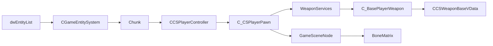

# CS2 Offset Reference


**[EN](#english) · [RU / Русский](#русский)**

---

## English

### Overview
Consolidated table of every CS2 client-side offset consulted across this
repo. Grouped by struct, with the exact source and the last live-verified
date. Baseline is depot `24134959`, CS2 Season-5, verified on 2026-07-18
against `cs2.exe` PID 55052 (client.dll base `0x7FFC94E70000`) and PID
57524 (client.dll base `0x7FFD235D0000`) via CE MCP.

### Files
| File                                                    | Purpose                                     |
|---------------------------------------------------------|---------------------------------------------|
| `source/dlls/AA_PeekOverride/src/sdk.h`                 | Canonical `Offsets` struct + trust-me types |
| `source/dlls/AA_PeekOverride/src/entity.h`              | Pawn / controller helpers using these       |
| `source/dlls/AA_PeekOverride/src/trace.cpp`             | Ray_t / trace_t / TraceFilter_t consumers   |
| `source/dlls/AA_PeekOverride/src/wallbang.h`            | CTraceInfo + TraceData_t walker             |
| `source/dlls/VacLiveBypass/src/core/remote_offsets.cpp` | VLB shared offset cache                     |
| `source/drivers/CS2NoclipDriver/main.cpp`               | Kernel-side pawn MoveType probe             |

### Sources
| Tag                | Origin                                                    |
|--------------------|-----------------------------------------------------------|
| `a2x`              | a2x/cs2-dumper HEAD 2026-07-10 / 2026-07-18 JSON          |
| `Bop32`            | UnknownCheats forum post, July 2026 (~build 14200+)       |
| `vasajekokot`      | UnknownCheats thread 576077 post #11451, Season-5 layouts |
| `xsip/PureLiquid`  | PureLiquid-CS2-External `CGameTraceManager.h`             |
| `Andromeda`        | Andromeda-CS2-Base `CS2/SDK/Update/GameTrace.hpp:12-22`   |
| `TempleWare`       | TempleWare-CS2-1.1.5 `prediction.cpp:65-71`               |
| `IMXNOOBX`         | IMXNOOBX cs2-external-esp entity walker                   |
| `live`             | Live-verified this repo via CE MCP, 2026-07-18            |

### Runtime

#### client.dll globals (RVA)
| Symbol                       | RVA          | Source     | Notes                                  |
|------------------------------|-------------:|------------|----------------------------------------|
| `dwEntityList`               | `0x254EE60`  | a2x, live  | CGameEntitySystem singleton            |
| `dwLocalPlayerController`    | `0x237EBA0`  | a2x, live  | CHandle<CCSPlayerController>           |
| `dwLocalPlayerPawn`          | `0x23A4238`  | a2x, live  | CHandle<C_CSPlayerPawn>                |
| `dwViewAngles`               | `0x23B9C78`  | a2x, live  | QAngle, pitch/yaw/roll                 |
| `dwIVPhysics2WorldPtr`       | `0x2083B00`  | a2x        | `IVPhysics2World**` — deref twice      |
| `CCSGOInput singleton`       | `0x23B95F0`  | live       | Used by VacLiveBypass (see CLAUDE.md)  |

#### CBasePlayerController / CCSPlayerController
| Field                          | Offset   | Source     | Notes                                |
|--------------------------------|---------:|------------|--------------------------------------|
| `m_hPawn`                      | `0x6BC`  | a2x        | CHandle<C_BasePlayerPawn>            |
| `m_nTickBase`                  | `0x6B8`  | a2x        | Server-authoritative tick base       |
| `m_iszPlayerName`              | `0x6F4`  | a2x        | UTL string ptr                       |
| `m_steamID`                    | `0x780`  | a2x        | uint64                               |
| `m_iPing`                      | `0x830`  | a2x        | Was `0x828` — +8 on Season-5         |
| `m_hPlayerPawn`                | `0x914`  | a2x        | Controller-side cache of pawn handle |
| `m_bPawnIsAlive`               | `0x91C`  | a2x        | bool                                 |
| `m_iPawnHealth`                | `0x920`  | a2x        | int32                                |
| `m_iPawnArmor`                 | `0x924`  | a2x        | int32                                |
| `m_bPawnHasHelmet`             | `0x929`  | a2x        | Substitute for removed HeavyArmor    |

#### C_BaseEntity
| Field                | Offset   | Source     | Notes                          |
|----------------------|---------:|------------|--------------------------------|
| `m_pGameSceneNode`   | `0x330`  | a2x, live  | Was `0x338` — -8 on Season-5   |
| `m_iHealth`          | `0x34C`  | a2x        | int32                          |
| `m_lifeState`        | `0x354`  | a2x        | uint8 LIFE_ALIVE / DEAD        |
| `m_nSubclassID`      | `0x380`  | a2x        | uint32                         |
| `m_iTeamNum`         | `0x3E7`  | a2x        | uint8                          |
| `m_vecAbsVelocity`   | `0x3F8`  | a2x, live  | Was `0x3FC` — -4               |
| `m_MoveType`         | `0x525`  | a2x        | uint8 — 8 = NOCLIP             |

#### C_BaseModelEntity → C_BasePlayerPawn → C_CSPlayerPawn
| Field                    | Offset    | Source     | Notes                                    |
|--------------------------|----------:|------------|------------------------------------------|
| `m_vecViewOffset`        | `0xE78`   | a2x, live  | Was `0xCA8` — +0x1D0 drift               |
| `m_pWeaponServices`      | `0x1208`  | a2x        | Was `0x1AF0` — -0x8E8                    |
| `m_pObserverServices`    | `0x1220`  | a2x        |                                          |
| `m_pMovementServices`    | `0x1248`  | a2x        |                                          |
| `m_vOldOrigin`           | `0x13B8`  | a2x        | Was `0x1324` — +0x94                     |
| `m_bIsScoped`            | `0x1C70`  | a2x        | bool                                     |
| `m_bIsDefusing`          | `0x1C72`  | a2x        | Was `0x1370`                             |
| `m_iShotsFired`          | `0x1C84`  | a2x        | int32 — resets on trigger release        |
| `m_ArmorValue`           | `0x1C9C`  | a2x        | Was `0x2384` — -0x6E8                    |

#### CPlayer_WeaponServices / C_BasePlayerWeapon
| Field                       | Offset    | Source     | Notes                        |
|-----------------------------|----------:|------------|------------------------------|
| `m_hActiveWeapon`           | `0x60`    | a2x        | Was `0x40` — +0x20           |
| `m_nNextPrimaryAttackTick`  | `0x16F0`  | a2x        | Weapon-side gate             |
| `m_iClip1`                  | `0x1700`  | a2x        | int32                        |

#### CCSWeaponBaseVData
| Field                       | Offset    | Source     | Notes                          |
|-----------------------------|----------:|------------|--------------------------------|
| `m_WeaponType`              | `0x520`   | a2x        | `CSWeaponType` enum            |
| `m_flCycleTime`             | `0x740`   | a2x        | float                          |
| `m_nDamage`                 | `0x828`   | a2x        | int32 — not float              |
| `m_flHeadshotMultiplier`    | `0x82C`   | a2x        | Was `0x1F0`                    |
| `m_flArmorRatio`            | `0x830`   | a2x        | Was `0x220`                    |
| `m_flPenetration`           | `0x834`   | a2x        | Was `0x228`                    |
| `m_flRange`                 | `0x838`   | a2x        | float                          |
| `m_flRangeModifier`         | `0x83C`   | a2x        | Was `0x230`                    |

#### CSkeletonInstance / bone matrix chain
| Field                            | Offset    | Source     | Notes                             |
|----------------------------------|----------:|------------|-----------------------------------|
| `m_modelState`                   | `0x140`   | a2x        | Off CSkeletonInstance             |
| `m_modelState.pBoneArray`        | `0x1C0`   | a2x        | = `0x140 + 0x80`                  |
| `bone_stride`                    | `32`      | pending    | Live-verify 32/40/48 open         |

#### Ray_t (Andromeda Season-5, flat 0x38)
| Field       | Offset   | Type   | Source     |
|-------------|---------:|--------|------------|
| `Start`     | `0x00`   | Vec3   | Andromeda  |
| `End`       | `0x0C`   | Vec3   | Andromeda  |
| `Mins`      | `0x18`   | Vec3   | Andromeda  |
| `Maxs`      | `0x24`   | Vec3   | Andromeda  |
| `Type`      | `0x34`   | uint8  | Andromeda  |
| `sizeof`    | `0x38`   | —      | Andromeda  |

#### trace_t / CGameTrace (vasajekokot post #11451, 0x140)
| Field                     | Offset   | Type      | Source          | Notes                            |
|---------------------------|---------:|-----------|-----------------|----------------------------------|
| `pSurfaceProperties`      | `0x00`   | void*     | vasajekokot     |                                  |
| `HitEntity`               | `0x08`   | void*     | vasajekokot     | nullptr = world hit              |
| `hitbox`                  | `0x10`   | void*     | vasajekokot     |                                  |
| `nSurfaceFlags`           | `0x50`   | uint32    | vasajekokot     |                                  |
| `Start`                   | `0x78`   | Vec3      | vasajekokot     |                                  |
| `End`                     | `0x84`   | Vec3      | vasajekokot     |                                  |
| `Normal`                  | `0x90`   | Vec3      | vasajekokot     |                                  |
| `Position`                | `0x9C`   | Vec3      | vasajekokot     | Final hit point                  |
| `Fraction`                | `0xAC`   | float     | vasajekokot     | 1.0 = unobstructed               |
| `m_debug_or_surface_idx`  | `0xB0`   | int32     | vasajekokot     |                                  |
| `m_hitbox_bone_or_index`  | `0xB4`   | uint16    | vasajekokot     |                                  |
| `m_ray_type`              | `0xB6`   | uint8     | vasajekokot     |                                  |
| `bStartSolid`             | `0xB7`   | bool      | vasajekokot     | Was `0xBB` pre-Season-5          |
| `sizeof`                  | `0x140`  | —         | vasajekokot     | Was `0xC0` pre-Season-5          |

#### TraceFilter_t (opaque blob)
| Field                       | Size    | Source          | Notes                                   |
|-----------------------------|--------:|-----------------|-----------------------------------------|
| `blob`                      | `0xC0`  | vasajekokot     | dick.rar reports true layout is `0xA4`  |
| min required                | `0xA4`  | vasajekokot     | 28-byte stack margin baked in           |

Constructor signature (vasajekokot): `void(CTraceFilter*, uint64 mask, void* skipEnt, uint8 layer, uint8 unk)`.
Andromeda invokes it with `mask=0x1C1003`, `layer=3`, `unkNum=15` for
player-visible line traces.

#### TraceData_t (create_trace target, ~0x2100 bytes)
| Field                    | Offset    | Type    | Source        | Notes                                  |
|--------------------------|----------:|---------|---------------|----------------------------------------|
| `m_trace_segments_ptr`   | `0x0008`  | void*   | vasajekokot   | Base for handle index math             |
| `m_nCurrentSurface`      | `0x1C20`  | int32   | vasajekokot   | Consumed by wallbang v2 as pen count   |
| `m_trace_info`           | `0x1C28`  | void*   | vasajekokot   | `CTraceInfo[]` array base              |
| `m_surfaces_count`       | `0x1C30`  | int32   | vasajekokot   | # of walls the ray touched             |
| `m_unkn_ptr`             | `0x1C38`  | void*   | vasajekokot   |                                        |
| `m_start`                | `0x1CF8`  | Vec3    | vasajekokot   |                                        |
| `m_end`                  | `0x1D04`  | Vec3    | vasajekokot   |                                        |

#### CTraceInfo (Bop32, `sizeof == 0x18`)
| Field                  | Offset  | Type    | Notes                                                   |
|------------------------|--------:|---------|---------------------------------------------------------|
| `m_flUnk`              | `0x00`  | float   |                                                         |
| `m_flDistance`         | `0x04`  | float   |                                                         |
| `m_flDamage`           | `0x08`  | float   | Populated by `HandleBulletPenetration` — 0 outside game |
| `m_nPenCount`          | `0x0C`  | uint32  |                                                         |
| `m_nHandle`            | `0x10`  | uint32  | `& 0x7FFF` = idx into segments (`0x38` stride)          |
| `m_nPenetrationFlags`  | `0x14`  | uint32  |                                                         |

#### handle_bullet_data_t (William, `sizeof == 0x18`)
| Field           | Offset  | Type    | Notes                                       |
|-----------------|--------:|---------|---------------------------------------------|
| `m_dmg`         | `0x00`  | float   | In/out — running damage                     |
| `m_pen`         | `0x04`  | float   | Weapon penetration power                    |
| `m_range_mod`   | `0x08`  | float   |                                             |
| `m_range`       | `0x0C`  | float   |                                             |
| `m_pen_count`   | `0x10`  | int32   | Remaining penetrations (starts at 4)        |
| `m_failed`      | `0x14`  | bool    | Game sets to 1 on stop                      |

#### Entity list stride (IMXNOOBX + live)
```
chunk  = *(entSys + 0x10 + 8 * (idx >> 9))
entity = *(chunk  + 0x70 * (idx & 0x1FF))
```
Stride is `0x70` (112 bytes), not `0x78`. Prior `0x78` conclusion was a
misread hex dump; corrected 2026-07-18.

### Architecture


### Constraints
- Depot `24134959` (CS2 Season-5) only. On new depot: rerun
  `scripts/auto_adapt_new_depot.ps1` and re-verify every offset live.
- All offsets are trust-me pointer math inside the injected DLL address
  space. Drift is a runtime crash, not a compile error — guard reads
  with `IsValidPtr` + SEH.
- Research / education / bug-bounty use. Never against Valve live
  servers.

---

## Русский

### Обзор
Сводная таблица всех CS2 client-side offsets, используемых в этом репо.
Сгруппировано по struct, с точным источником и датой последней live-проверки.
Baseline — depot `24134959`, CS2 Season-5, проверено 2026-07-18 против
`cs2.exe` PID 55052 (client.dll base `0x7FFC94E70000`) и PID 57524
(client.dll base `0x7FFD235D0000`) через CE MCP.

### Файлы
| Файл                                                    | Назначение                                  |
|---------------------------------------------------------|---------------------------------------------|
| `source/dlls/AA_PeekOverride/src/sdk.h`                 | Каноничный `Offsets` struct + trust-me типы |
| `source/dlls/AA_PeekOverride/src/entity.h`              | Хелперы pawn / controller                   |
| `source/dlls/AA_PeekOverride/src/trace.cpp`             | Потребители Ray_t / trace_t / TraceFilter_t |
| `source/dlls/AA_PeekOverride/src/wallbang.h`            | Обход CTraceInfo + TraceData_t              |
| `source/dlls/VacLiveBypass/src/core/remote_offsets.cpp` | VLB shared offset cache                     |
| `source/drivers/CS2NoclipDriver/main.cpp`               | Kernel-side pawn MoveType probe             |

### Источники
| Tag                | Происхождение                                             |
|--------------------|-----------------------------------------------------------|
| `a2x`              | a2x/cs2-dumper HEAD 2026-07-10 / 2026-07-18 JSON          |
| `Bop32`            | UnknownCheats forum post, июль 2026 (~build 14200+)       |
| `vasajekokot`      | UnknownCheats тред 576077 post #11451, Season-5 layouts   |
| `xsip/PureLiquid`  | PureLiquid-CS2-External `CGameTraceManager.h`             |
| `Andromeda`        | Andromeda-CS2-Base `CS2/SDK/Update/GameTrace.hpp:12-22`   |
| `TempleWare`       | TempleWare-CS2-1.1.5 `prediction.cpp:65-71`               |
| `IMXNOOBX`         | IMXNOOBX cs2-external-esp entity walker                   |
| `live`             | Live-verified в этом репо через CE MCP, 2026-07-18        |

### Runtime

#### client.dll globals (RVA)
| Symbol                       | RVA          | Source     | Notes                                  |
|------------------------------|-------------:|------------|----------------------------------------|
| `dwEntityList`               | `0x254EE60`  | a2x, live  | CGameEntitySystem singleton            |
| `dwLocalPlayerController`    | `0x237EBA0`  | a2x, live  | CHandle<CCSPlayerController>           |
| `dwLocalPlayerPawn`          | `0x23A4238`  | a2x, live  | CHandle<C_CSPlayerPawn>                |
| `dwViewAngles`               | `0x23B9C78`  | a2x, live  | QAngle, pitch/yaw/roll                 |
| `dwIVPhysics2WorldPtr`       | `0x2083B00`  | a2x        | `IVPhysics2World**` — deref дважды     |
| `CCSGOInput singleton`       | `0x23B95F0`  | live       | Используется VacLiveBypass             |

#### CBasePlayerController / CCSPlayerController
| Field                          | Offset   | Source     | Notes                                |
|--------------------------------|---------:|------------|--------------------------------------|
| `m_hPawn`                      | `0x6BC`  | a2x        | CHandle<C_BasePlayerPawn>            |
| `m_nTickBase`                  | `0x6B8`  | a2x        | Server-authoritative tick base       |
| `m_iszPlayerName`              | `0x6F4`  | a2x        | UTL string ptr                       |
| `m_steamID`                    | `0x780`  | a2x        | uint64                               |
| `m_iPing`                      | `0x830`  | a2x        | Было `0x828` — +8 на Season-5        |
| `m_hPlayerPawn`                | `0x914`  | a2x        | Controller-side cache pawn handle    |
| `m_bPawnIsAlive`               | `0x91C`  | a2x        | bool                                 |
| `m_iPawnHealth`                | `0x920`  | a2x        | int32                                |
| `m_iPawnArmor`                 | `0x924`  | a2x        | int32                                |
| `m_bPawnHasHelmet`             | `0x929`  | a2x        | Замена удалённому HeavyArmor         |

#### C_BaseEntity
| Field                | Offset   | Source     | Notes                          |
|----------------------|---------:|------------|--------------------------------|
| `m_pGameSceneNode`   | `0x330`  | a2x, live  | Было `0x338` — -8 на Season-5  |
| `m_iHealth`          | `0x34C`  | a2x        | int32                          |
| `m_lifeState`        | `0x354`  | a2x        | uint8 LIFE_ALIVE / DEAD        |
| `m_nSubclassID`      | `0x380`  | a2x        | uint32                         |
| `m_iTeamNum`         | `0x3E7`  | a2x        | uint8                          |
| `m_vecAbsVelocity`   | `0x3F8`  | a2x, live  | Было `0x3FC` — -4              |
| `m_MoveType`         | `0x525`  | a2x        | uint8 — 8 = NOCLIP             |

#### C_BaseModelEntity → C_BasePlayerPawn → C_CSPlayerPawn
| Field                    | Offset    | Source     | Notes                                    |
|--------------------------|----------:|------------|------------------------------------------|
| `m_vecViewOffset`        | `0xE78`   | a2x, live  | Было `0xCA8` — +0x1D0                    |
| `m_pWeaponServices`      | `0x1208`  | a2x        | Было `0x1AF0` — -0x8E8                   |
| `m_pObserverServices`    | `0x1220`  | a2x        |                                          |
| `m_pMovementServices`    | `0x1248`  | a2x        |                                          |
| `m_vOldOrigin`           | `0x13B8`  | a2x        | Было `0x1324` — +0x94                    |
| `m_bIsScoped`            | `0x1C70`  | a2x        | bool                                     |
| `m_bIsDefusing`          | `0x1C72`  | a2x        | Было `0x1370`                            |
| `m_iShotsFired`          | `0x1C84`  | a2x        | int32 — сброс на отпускание trigger      |
| `m_ArmorValue`           | `0x1C9C`  | a2x        | Было `0x2384` — -0x6E8                   |

#### CPlayer_WeaponServices / C_BasePlayerWeapon
| Field                       | Offset    | Source     | Notes                        |
|-----------------------------|----------:|------------|------------------------------|
| `m_hActiveWeapon`           | `0x60`    | a2x        | Было `0x40` — +0x20          |
| `m_nNextPrimaryAttackTick`  | `0x16F0`  | a2x        | Weapon-side gate             |
| `m_iClip1`                  | `0x1700`  | a2x        | int32                        |

#### CCSWeaponBaseVData
| Field                       | Offset    | Source     | Notes                          |
|-----------------------------|----------:|------------|--------------------------------|
| `m_WeaponType`              | `0x520`   | a2x        | `CSWeaponType` enum            |
| `m_flCycleTime`             | `0x740`   | a2x        | float                          |
| `m_nDamage`                 | `0x828`   | a2x        | int32 — не float               |
| `m_flHeadshotMultiplier`    | `0x82C`   | a2x        | Было `0x1F0`                   |
| `m_flArmorRatio`            | `0x830`   | a2x        | Было `0x220`                   |
| `m_flPenetration`           | `0x834`   | a2x        | Было `0x228`                   |
| `m_flRange`                 | `0x838`   | a2x        | float                          |
| `m_flRangeModifier`         | `0x83C`   | a2x        | Было `0x230`                   |

#### CSkeletonInstance / bone matrix chain
| Field                            | Offset    | Source     | Notes                             |
|----------------------------------|----------:|------------|-----------------------------------|
| `m_modelState`                   | `0x140`   | a2x        | Off CSkeletonInstance             |
| `m_modelState.pBoneArray`        | `0x1C0`   | a2x        | = `0x140 + 0x80`                  |
| `bone_stride`                    | `32`      | pending    | Live-verify 32/40/48 открыт       |

#### Ray_t (Andromeda Season-5, flat 0x38)
| Field       | Offset   | Type   | Source     |
|-------------|---------:|--------|------------|
| `Start`     | `0x00`   | Vec3   | Andromeda  |
| `End`       | `0x0C`   | Vec3   | Andromeda  |
| `Mins`      | `0x18`   | Vec3   | Andromeda  |
| `Maxs`      | `0x24`   | Vec3   | Andromeda  |
| `Type`      | `0x34`   | uint8  | Andromeda  |
| `sizeof`    | `0x38`   | —      | Andromeda  |

#### trace_t / CGameTrace (vasajekokot post #11451, 0x140)
| Field                     | Offset   | Type      | Source          | Notes                            |
|---------------------------|---------:|-----------|-----------------|----------------------------------|
| `pSurfaceProperties`      | `0x00`   | void*     | vasajekokot     |                                  |
| `HitEntity`               | `0x08`   | void*     | vasajekokot     | nullptr = world hit              |
| `hitbox`                  | `0x10`   | void*     | vasajekokot     |                                  |
| `nSurfaceFlags`           | `0x50`   | uint32    | vasajekokot     |                                  |
| `Start`                   | `0x78`   | Vec3      | vasajekokot     |                                  |
| `End`                     | `0x84`   | Vec3      | vasajekokot     |                                  |
| `Normal`                  | `0x90`   | Vec3      | vasajekokot     |                                  |
| `Position`                | `0x9C`   | Vec3      | vasajekokot     | Итоговая точка удара             |
| `Fraction`                | `0xAC`   | float     | vasajekokot     | 1.0 = без препятствий            |
| `m_debug_or_surface_idx`  | `0xB0`   | int32     | vasajekokot     |                                  |
| `m_hitbox_bone_or_index`  | `0xB4`   | uint16    | vasajekokot     |                                  |
| `m_ray_type`              | `0xB6`   | uint8     | vasajekokot     |                                  |
| `bStartSolid`             | `0xB7`   | bool      | vasajekokot     | Было `0xBB` до Season-5          |
| `sizeof`                  | `0x140`  | —         | vasajekokot     | Было `0xC0` до Season-5          |

#### TraceFilter_t (opaque blob)
| Field                       | Size    | Source          | Notes                                    |
|-----------------------------|--------:|-----------------|------------------------------------------|
| `blob`                      | `0xC0`  | vasajekokot     | dick.rar сообщает реальный layout `0xA4` |
| min required                | `0xA4`  | vasajekokot     | 28-байтовый stack-запас                  |

Сигнатура конструктора (vasajekokot): `void(CTraceFilter*, uint64 mask, void* skipEnt, uint8 layer, uint8 unk)`.
Andromeda вызывает с `mask=0x1C1003`, `layer=3`, `unkNum=15` для
player-visible line trace.

#### TraceData_t (target для create_trace, ~0x2100 байт)
| Field                    | Offset    | Type    | Source        | Notes                                  |
|--------------------------|----------:|---------|---------------|----------------------------------------|
| `m_trace_segments_ptr`   | `0x0008`  | void*   | vasajekokot   | База для handle index math             |
| `m_nCurrentSurface`      | `0x1C20`  | int32   | vasajekokot   | Использует wallbang v2 как pen count   |
| `m_trace_info`           | `0x1C28`  | void*   | vasajekokot   | База массива `CTraceInfo[]`            |
| `m_surfaces_count`       | `0x1C30`  | int32   | vasajekokot   | # стен, которые ray прошёл             |
| `m_unkn_ptr`             | `0x1C38`  | void*   | vasajekokot   |                                        |
| `m_start`                | `0x1CF8`  | Vec3    | vasajekokot   |                                        |
| `m_end`                  | `0x1D04`  | Vec3    | vasajekokot   |                                        |

#### CTraceInfo (Bop32, `sizeof == 0x18`)
| Field                  | Offset  | Type    | Notes                                                   |
|------------------------|--------:|---------|---------------------------------------------------------|
| `m_flUnk`              | `0x00`  | float   |                                                         |
| `m_flDistance`         | `0x04`  | float   |                                                         |
| `m_flDamage`           | `0x08`  | float   | Заполняет `HandleBulletPenetration` — 0 вне матча       |
| `m_nPenCount`          | `0x0C`  | uint32  |                                                         |
| `m_nHandle`            | `0x10`  | uint32  | `& 0x7FFF` = idx в segments (`0x38` stride)             |
| `m_nPenetrationFlags`  | `0x14`  | uint32  |                                                         |

#### handle_bullet_data_t (William, `sizeof == 0x18`)
| Field           | Offset  | Type    | Notes                                       |
|-----------------|--------:|---------|---------------------------------------------|
| `m_dmg`         | `0x00`  | float   | In/out — running damage                     |
| `m_pen`         | `0x04`  | float   | Weapon penetration power                    |
| `m_range_mod`   | `0x08`  | float   |                                             |
| `m_range`       | `0x0C`  | float   |                                             |
| `m_pen_count`   | `0x10`  | int32   | Оставшиеся пенетрации (start 4)             |
| `m_failed`      | `0x14`  | bool    | Игра ставит 1 при остановке пули            |

#### Entity list stride (IMXNOOBX + live)
```
chunk  = *(entSys + 0x10 + 8 * (idx >> 9))
entity = *(chunk  + 0x70 * (idx & 0x1FF))
```
Stride — `0x70` (112 байт), не `0x78`. Прежний вывод про `0x78` — miscount
hex dump; исправлено 2026-07-18.

### Архитектура


### Ограничения
- Только depot `24134959` (CS2 Season-5). На новом depot: перезапустить
  `scripts/auto_adapt_new_depot.ps1` и re-verify каждый offset live.
- Все offsets — trust-me pointer math внутри адресного пространства
  injected DLL. Drift — runtime crash, не compile error — guard reads
  через `IsValidPtr` + SEH.
- Research / education / bug-bounty. Не для боевых серверов Valve.
