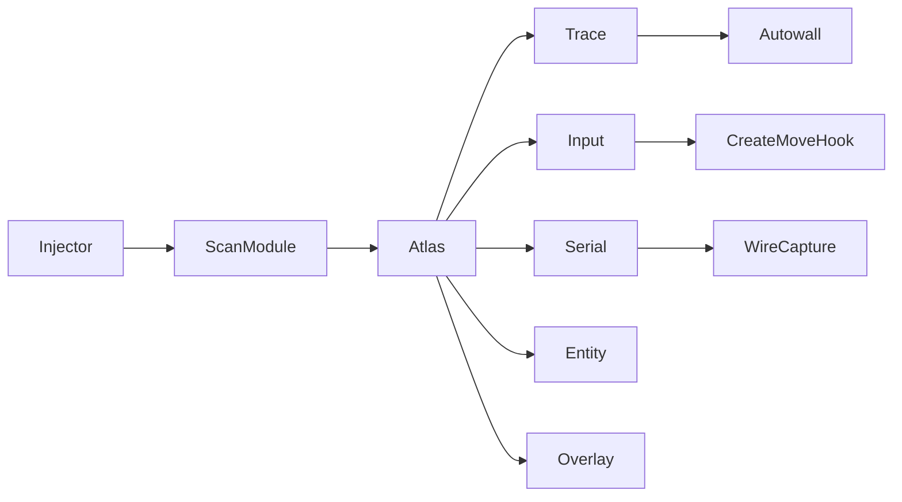

# CS2-Signature-Reference


**[EN](#english) · [RU / Русский](#русский)**

---

## English

### Overview
Catalogue of every `client.dll`, `engine2.dll`, `animationsystem.dll`,
`tier0.dll`, `materialsystem2.dll`, `soundsystem.dll` and
`GameOverlayRenderer64.dll` byte-pattern scanned by any module in this
repo. Grouped by subsystem. Each row lists the sig string, the target
prototype, the source file that owns the scan, and the depot on which
the pattern was last verified.

### Files
| File                                                            | Purpose                                          |
|-----------------------------------------------------------------|--------------------------------------------------|
| `source/dlls/VacLiveBypass/src/patterns/cs2_signature_atlas.h`  | 139-pattern catalogue (all subsystems)           |
| `source/dlls/VacLiveBypass/src/patterns/patterns_legacy.inl`    | Legacy depot 2347770 anchors                     |
| `source/dlls/VacLiveBypass/src/version_manifest.h`              | Per-depot RVA + prologue table                   |
| `source/dlls/AA_PeekOverride/src/hooks.cpp`                     | `CreateMove` scan                                |
| `source/dlls/AA_PeekOverride/src/trace.cpp`                     | vasajekokot + yougey + Bop32 trace chain sigs    |
| `source/dlls/AA_PeekOverride/src/sig_scan.cpp`                  | IDA-style pattern parser                         |

### Build
Sigs are compile-time constants. Consumers scan at DLL load. To
regenerate the atlas after a depot bump.

```powershell
cd source\dlls\VacLiveBypass
cmake -B build -DFVA_TARGET_DEPOT=24134959
cmake --build build --config Release --target fva_recon
```

To live-verify a single sig against a running `client.dll` via CE MCP.

```powershell
python scripts\ce_aob_scan.py --module client.dll --pattern "48 8B C4 4C 89 40 ? 48 89 48 ? 55 53 41 54"
```

### Runtime

Wildcard is `?` (single-byte) or `??` (both accepted by the parser in
`sig_scan.cpp`). Verified column reads `2026-07-10` for the atlas
snapshot and `2026-07-18` for the AA_PeekOverride Season-5 chain.

#### Input / CreateMove chain (client.dll)

| Function                     | Sig                                                                                                            | Prototype                                                          | Owner                              | Verified   |
|------------------------------|----------------------------------------------------------------------------------------------------------------|--------------------------------------------------------------------|------------------------------------|-----------:|
| `CreateMove`                 | `48 8B C4 4C 89 40 ? 48 89 48 ? 55 53 41 54`                                                                   | `double __fastcall(__int64, unsigned int, __int64)`                | `AA_PeekOverride/src/hooks.cpp`    | 2026-07-18 |
| `CreateMovePrePrediction`    | `48 8B C4 44 88 40 ? 89 50 ? 48 89 48 ? 55 53 41 54 41 57 48 8D A8 ?`                                          | `void __fastcall(CInput*, int slot, bool active)`                  | `patterns_legacy.inl` (Hook A)     | 2026-07-10 |
| `CreateNewSubtickMoveStep`   | `48 89 5C 24 ? 57 48 83 EC ? 33 DB 48 8B F9 48 85 C9 75 ? B9 ? ? ? ? E8 ? ? ? ? 48 85 C0 74 ? 45 33 C0 33 D2 48 8B C8 E8 ? ? ? ? 48 8B D8` | `CSubtickMoveStep* __fastcall(void* arena)`                        | `cs2_signature_atlas.h`            | 2026-07-10 |
| `ForceButtonsDown`           | `40 53 57 41 56 48 81 EC ? ? ? ? 48 83 79 ? 00`                                                                | `void __fastcall(CUserCmd*, uint64_t mask)`                        | `cs2_signature_atlas.h`            | 2026-07-10 |
| `ValidateInput`              | `40 53 48 83 EC ? 48 8B D9 E8 ? ? ? ? 33 C0 C6 83 ? ? ? ? 00 48 C7 83`                                         | `void __fastcall(CInput*)`                                         | `cs2_signature_atlas.h`            | 2026-07-10 |
| `GetViewAngles`              | `4C 8B C1 85 D2 74 ? 48 8D 05`                                                                                 | `void __fastcall(CInput*, QAngle* out, int slot)`                  | `cs2_signature_atlas.h`            | 2026-07-10 |
| `SetViewAngles`              | `85 D2 75 ? 48 63 81`                                                                                          | `void __fastcall(CInput*, const QAngle*, int slot)`                | `cs2_signature_atlas.h`            | 2026-07-10 |

#### Serialization / networking (client.dll)

| Function                          | Sig                                                                                              | Prototype                                                          | Owner                              | Verified   |
|-----------------------------------|--------------------------------------------------------------------------------------------------|--------------------------------------------------------------------|------------------------------------|-----------:|
| `SerializeToArray` (post-patch)   | `55 56 57 48 81 EC 90 00 00 00 48 8B 05 ? ? ? ? 48 33 C4 48 89 84 24 80 00 00`                   | `uint8_t* __fastcall(MessageLite*, uint8_t* target)` (`-5` offset) | `patterns_legacy.inl` (Hook C)     | 2026-07-10 |
| `SerializePartialToArray`         | 5-byte hotpatch `48 89 5C 24 18`                                                                 | `uint8_t* __fastcall(CBaseUserCmdPB*, uint8_t* target)`            | `version_manifest.h`               | 2026-07-10 |
| `FireLevelInitEvent` (legacy)     | `48 8D 6C 24 B9 48 81 EC E0 00 00 00 48 8B 0D ? ? ? ? 4C 8B F2 45 33 C9`                         | `void __fastcall(CBaseClientState*, const char* map)`              | `patterns_legacy.inl` (Hook B)     | 2026-07-10 |
| `LevelInit`                       | `48 89 74 24 ? 57 48 83 EC ? 48 8B 0D ? ? ? ? 48 8B FA`                                          | `void __fastcall(IGameSystem*, const LevelInitPreEntity_t*)`       | `cs2_signature_atlas.h`            | 2026-07-10 |
| `LevelShutdown`                   | `48 83 EC ? 48 8B 0D ? ? ? ? 48 8D 15 ? ? ? ? 45 33 C9 45 33 C0`                                 | `void __fastcall(IGameSystem*)`                                    | `cs2_signature_atlas.h`            | 2026-07-10 |
| `FrameStageNotify`                | `48 89 5C 24 ? 48 89 6C 24 ? 57 48 83 EC ? 48 8B F9 33 ED`                                       | `void __fastcall(IBaseClientDLL*, int stage)`                      | `cs2_signature_atlas.h`            | 2026-07-10 |

#### Trace / autowall — vasajekokot + Bop32 + yougey chain (client.dll)

| Function                     | Sig                                                                                                            | Prototype                                                                              | Owner                              | Verified   |
|------------------------------|----------------------------------------------------------------------------------------------------------------|----------------------------------------------------------------------------------------|------------------------------------|-----------:|
| `init_trace_data`            | `48 89 5C 24 ? 48 89 74 24 ? 57 48 83 EC ? 48 8D 79 ? 33 F6 C7 47`                                             | `TraceData_t* __fastcall(TraceData_t*)`                                                | `AA_PeekOverride/src/trace.cpp`    | 2026-07-18 |
| `init_trace_info`            | `40 55 41 55 41 57 48 83 EC`                                                                                   | `trace_t* __fastcall(trace_t*)`                                                        | `AA_PeekOverride/src/trace.cpp`    | 2026-07-18 |
| `get_trace_info`             | `48 89 5C 24 ? 48 89 6C 24 ? 48 89 74 24 ? 57 48 81 EC ? ? ? ? 48 8B E9 0F 29 74 24`                           | `void __fastcall(TraceData_t*, trace_t*, float, void* handle)`                         | `AA_PeekOverride/src/trace.cpp`    | 2026-07-18 |
| `init_trace_filter`          | `48 89 5C 24 ? 48 89 74 24 ? 57 48 83 EC ? 0F B6 41 ? 33 FF 24`                                                | `TraceFilter_t* __fastcall(TraceFilter_t*, void* skip, uint64_t mask, uint8_t l, uint8_t)` | `AA_PeekOverride/src/trace.cpp` | 2026-07-18 |
| `create_trace`               | `48 89 5C 24 ? 48 89 6C 24 ? 48 89 74 24 ? 57 41 56 41 57 48 83 EC ? ? ? ? ? 4D 8D 71`                         | `bool __fastcall(TraceData_t*, Vec3 from, Vec3 delta, TraceFilter_t*, int pen, bool)`  | `AA_PeekOverride/src/trace.cpp`    | 2026-07-18 |
| `create_trace_alt`           | `48 89 5C 24 ? 48 89 6C 24 ? 48 89 74 24 ? 57 41 56 41 57 48 83 EC ? F2 0F 10 02`                              | same prototype as `create_trace`                                                       | `AA_PeekOverride/src/trace.cpp`    | 2026-07-18 |
| `damage_to_point`            | `40 53 57 41 56 48 83 EC ? 8B 84 24`                                                                           | `uint64_t __fastcall(TraceData_t*, float dmg, float pen, float range, int hg, int team, void*)` | `AA_PeekOverride/src/trace.cpp` | 2026-07-18 |
| `HandleBulletPenetration`    | `48 8B C4 44 89 48 ? 48 89 50 ? 48 89 48 ? 55 57`                                                              | `bool __fastcall(TraceData_t*, handle_bullet_data_t*, CTraceInfo*, int team, void*)`   | `AA_PeekOverride/src/trace.cpp`    | 2026-07-18 |
| `CalcShootPos`               | `48 89 5C 24 ?? 48 89 6C 24 ?? 56 57 41 56 48 83 EC ?? 44 8B 92`                                               | `void __fastcall(Vec3* out, void* pawn, TimeStamp_t*, void*, void*)`                   | `AA_PeekOverride/src/trace.cpp`    | 2026-07-18 |

#### Rendering / view (client.dll)

| Function             | Sig                                                                                              | Prototype                                                          | Owner                              | Verified   |
|----------------------|--------------------------------------------------------------------------------------------------|--------------------------------------------------------------------|------------------------------------|-----------:|
| `OverrideView`       | `40 57 48 83 EC ? 48 8B FA E8 ? ? ? ? BA`                                                        | `void __fastcall(IBaseClientDLL*, CViewSetup*)`                    | `cs2_signature_atlas.h`            | 2026-07-10 |
| `DrawScopeOverlay`   | `48 8B C4 53 57 48 83 EC ? 48 8B FA`                                                             | `void __fastcall(IViewRender*, CViewSetup*)`                       | `cs2_signature_atlas.h`            | 2026-07-10 |
| `DrawLegs`           | `40 55 53 56 41 56 41 57 48 8D AC 24 ? ? ? ? 48 81 EC ? ? ? ? F2 0F 10 42`                       | `void __fastcall(C_CSPlayerPawn*)`                                 | `cs2_signature_atlas.h`            | 2026-07-10 |

#### Entity / world (client.dll)

| Function                 | Sig                                                                                                                       | Prototype                                                | Owner                              | Verified   |
|--------------------------|---------------------------------------------------------------------------------------------------------------------------|----------------------------------------------------------|------------------------------------|-----------:|
| `GetLocalPawn`           | `48 83 EC ? 83 F9 ? 75 ? 48 8B 0D ? ? ? ? 48 8D 54 24 ? ? ? ? FF 90 ? ? ? ? ? ? 48 63 C1 4C 8D 05`                        | `C_CSPlayerPawn* __fastcall(int slot)`                   | `cs2_signature_atlas.h`            | 2026-07-10 |
| `GetLocalController`     | `48 83 EC ? 83 F9 ? 75 ? 48 8B 0D ? ? ? ? 48 8D 54 24 ? ? ? ? FF 90 ? ? ? ? ? ? 48 63 C1 48 8D 0D`                        | `C_CSPlayerController* __fastcall(int slot)`             | `cs2_signature_atlas.h`            | 2026-07-10 |
| `GetEntityByIndex`       | `4C 8D 49 ? 81 FA`                                                                                                        | `C_BaseEntity* __fastcall(CGameEntitySystem*, int idx)`  | `cs2_signature_atlas.h`            | 2026-07-10 |
| `ComputeRandomSeed`      | `48 89 5C 24 ? 57 48 81 EC ? ? ? ? ? ? ? ? 48 8D 8C 24`                                                                   | `uint32_t __fastcall(CUserCmd*)`                         | `cs2_signature_atlas.h`            | 2026-07-10 |
| `UpdateGlobalVars`       | `48 8B 0D ? ? ? ? 4C 8D 05 ? ? ? ? 48 85 D2`                                                                              | `void __fastcall(CGlobalVars*)`                          | `cs2_signature_atlas.h`            | 2026-07-10 |

#### Engine / networking (engine2.dll, tier0.dll)

| Function                 | Module          | Sig                                                                                                                 | Prototype                                     | Owner                    | Verified   |
|--------------------------|-----------------|---------------------------------------------------------------------------------------------------------------------|-----------------------------------------------|--------------------------|-----------:|
| `IsInGame`               | `engine2.dll`   | `48 8B 05 ? ? ? ? 48 85 C0 74 ? 80 B8 ? ? ? ? 00 75 ? 83 B8 ? ? ? ? ? 7C`                                           | `bool __fastcall()`                           | `cs2_signature_atlas.h`  | 2026-07-10 |
| `IsConnected`            | `engine2.dll`   | `48 8B 05 ? ? ? ? 48 85 C0 74 ? 83 B8 ? ? ? ? ? 0F 9D C0`                                                           | `bool __fastcall()`                           | `cs2_signature_atlas.h`  | 2026-07-10 |
| `GetLevelName`           | `engine2.dll`   | `48 83 EC ? E8 ? ? ? ? 84 C0 74 ? 48 8D 05 ? ? ? ? 48 83 C4 ? C3 48 8B 0D ? ? ? ? 48 85 C9 74 ? 83 B9 ? ? ? ? ? 7C ? 48 8B 89` | `const char* __fastcall()`             | `cs2_signature_atlas.h`  | 2026-07-10 |
| `LoadKV3` (mangled)      | `tier0.dll`     | `?LoadKV3@@YA_NPEAVKeyValues3@@PEAVCUtlString@@PEBDAEBUKV3ID_t@@2I@Z`                                               | `bool __fastcall(KeyValues3*, CUtlString*, const char*, const KV3ID_t&, KV3ID_t, unsigned)` | `cs2_signature_atlas.h` | 2026-07-10 |

#### Assets / audio (materialsystem2.dll, soundsystem.dll)

| Function          | Module                | Sig                                                                                                                              | Prototype                                        | Owner                    | Verified   |
|-------------------|-----------------------|----------------------------------------------------------------------------------------------------------------------------------|--------------------------------------------------|--------------------------|-----------:|
| `CreateMaterial`  | `materialsystem2.dll` | `48 89 5C 24 ? 48 89 6C 24 ? 48 89 74 24 ? 48 89 7C 24 ? 41 56 48 81 EC ? ? ? ? 48 8B 05 ? ? ? ? 48 8B F2`                       | `IMaterial2* __fastcall(const char*, const char*)` | `cs2_signature_atlas.h` | 2026-07-10 |
| `PlayVSND`        | `soundsystem.dll`     | `48 89 5C 24 ? 48 89 74 24 ? 48 89 7C 24 ? 55 48 8D 6C 24 ? 48 81 EC ? ? ? ? 33 F6 C7 45 ? ? ? ? ? 4C 8B C1`                     | `int __fastcall(const char* path, ...)`          | `cs2_signature_atlas.h`  | 2026-07-10 |

#### Overlay (GameOverlayRenderer64.dll)

| Function   | Sig                                                                                                            | Prototype                                          | Owner                    | Verified   |
|------------|----------------------------------------------------------------------------------------------------------------|----------------------------------------------------|--------------------------|-----------:|
| `Present`  | `48 89 5C 24 ? 48 89 6C 24 ? 56 57 41 54 41 56 41 57 48 83 EC ? 41 8B E8`                                      | `HRESULT __fastcall(IDXGISwapChain*, UINT, UINT)`  | `cs2_signature_atlas.h`  | 2026-07-10 |

<details>
<summary>Per-depot RVA fallback table</summary>

| Symbol                          | Module      | 14167          | 24134959       |
|---------------------------------|-------------|---------------:|---------------:|
| Hook A (CreateMovePrePrediction)| client.dll  | `0x00ACEF90`   | `0x00B09528`   |
| Hook B (LevelInit-family)       | client.dll  | `0x00AFDFB0`   | `0x00B3A600`   |
| Hook C (SerializePartialToArray)| client.dll  | `0x01189930`   | `0x011AD4E0`   |
| Hook D (ShouldUpdateSequences)  | animsys.dll | `0x0014EFF0`   | `0x0014EFF0`   |
| CreateMove (outer)              | client.dll  | `0x00C65FE0`   | `0x00C97750`   |
| CBaseUserCmdPB::New             | client.dll  | `0x004B21E0`   | `0x004E2300`   |
| CSubtickMoveStep::New           | client.dll  | `0x004B22D0`   | `0x004E23F0`   |
| CInButtonStatePB::New           | client.dll  | `0x004B2250`   | `0x004E2370`   |
| CMsgQAngle::New                 | client.dll  | `0x006840F0`   | `0x0065B1F0`   |
| CSGOInputHistoryEntryPB::New    | client.dll  | `0x00742730`   | `0x00777410`   |
| CBaseUserCmdPB vtable           | client.dll  | `0x01995748`   | `0x019D5588`   |
| ArenaStringPtr::Set             | client.dll  | `0x011712C0`   | `0x01194E70`   |
| Heap alloc wrapper              | client.dll  | `0x00B931D0`   | `0x00BCB040`   |

</details>

### Architecture



### Constraints
- Depots `14167` and `24134959` for the atlas; `2347770` for the legacy anchors; Season-5 build `14169` for the AA_PeekOverride chain.
- Sigs re-scanned on every DLL load; RVAs in `version_manifest.h` are fallbacks, not primary lookups.
- Wildcard token is `?` or `??` — `sig_scan.cpp` accepts both.
- Research / education / bug-bounty use. Not for live Valve servers.

---

## Русский

### Обзор
Каталог всех byte-pattern для `client.dll`, `engine2.dll`,
`animationsystem.dll`, `tier0.dll`, `materialsystem2.dll`,
`soundsystem.dll` и `GameOverlayRenderer64.dll`, которые сканирует
любой модуль репо. Сгруппировано по подсистемам. Каждая строка
содержит sig-строку, prototype таргета, source-файл, владеющий
сканом, и depot, на котором pattern был последний раз проверен.

### Файлы
| Файл                                                            | Назначение                                       |
|-----------------------------------------------------------------|--------------------------------------------------|
| `source/dlls/VacLiveBypass/src/patterns/cs2_signature_atlas.h`  | Каталог 139 patterns (все подсистемы)            |
| `source/dlls/VacLiveBypass/src/patterns/patterns_legacy.inl`    | Anchors для legacy depot 2347770                 |
| `source/dlls/VacLiveBypass/src/version_manifest.h`              | Per-depot таблица RVA + prologue                 |
| `source/dlls/AA_PeekOverride/src/hooks.cpp`                     | Скан `CreateMove`                                |
| `source/dlls/AA_PeekOverride/src/trace.cpp`                     | Sigs trace-цепочки vasajekokot + yougey + Bop32  |
| `source/dlls/AA_PeekOverride/src/sig_scan.cpp`                  | Парсер IDA-style pattern                         |

### Сборка
Sigs — compile-time константы. Потребители сканируют при загрузке
DLL. Для перегенерации атласа после депот-бампа.

```powershell
cd source\dlls\VacLiveBypass
cmake -B build -DFVA_TARGET_DEPOT=24134959
cmake --build build --config Release --target fva_recon
```

Для live-verify одного sig против запущенной `client.dll` через CE MCP.

```powershell
python scripts\ce_aob_scan.py --module client.dll --pattern "48 8B C4 4C 89 40 ? 48 89 48 ? 55 53 41 54"
```

### Runtime

Wildcard — `?` (single-byte) или `??` (оба принимаются парсером
`sig_scan.cpp`). Колонка Verified читается как `2026-07-10` для
snapshot атласа и `2026-07-18` для Season-5 цепочки AA_PeekOverride.

#### Ввод / CreateMove цепочка (client.dll)

| Функция                      | Sig                                                                                                            | Prototype                                                          | Owner                              | Verified   |
|------------------------------|----------------------------------------------------------------------------------------------------------------|--------------------------------------------------------------------|------------------------------------|-----------:|
| `CreateMove`                 | `48 8B C4 4C 89 40 ? 48 89 48 ? 55 53 41 54`                                                                   | `double __fastcall(__int64, unsigned int, __int64)`                | `AA_PeekOverride/src/hooks.cpp`    | 2026-07-18 |
| `CreateMovePrePrediction`    | `48 8B C4 44 88 40 ? 89 50 ? 48 89 48 ? 55 53 41 54 41 57 48 8D A8 ?`                                          | `void __fastcall(CInput*, int slot, bool active)`                  | `patterns_legacy.inl` (Hook A)     | 2026-07-10 |
| `CreateNewSubtickMoveStep`   | `48 89 5C 24 ? 57 48 83 EC ? 33 DB 48 8B F9 48 85 C9 75 ? B9 ? ? ? ? E8 ? ? ? ? 48 85 C0 74 ? 45 33 C0 33 D2 48 8B C8 E8 ? ? ? ? 48 8B D8` | `CSubtickMoveStep* __fastcall(void* arena)`                        | `cs2_signature_atlas.h`            | 2026-07-10 |
| `ForceButtonsDown`           | `40 53 57 41 56 48 81 EC ? ? ? ? 48 83 79 ? 00`                                                                | `void __fastcall(CUserCmd*, uint64_t mask)`                        | `cs2_signature_atlas.h`            | 2026-07-10 |
| `ValidateInput`              | `40 53 48 83 EC ? 48 8B D9 E8 ? ? ? ? 33 C0 C6 83 ? ? ? ? 00 48 C7 83`                                         | `void __fastcall(CInput*)`                                         | `cs2_signature_atlas.h`            | 2026-07-10 |
| `GetViewAngles`              | `4C 8B C1 85 D2 74 ? 48 8D 05`                                                                                 | `void __fastcall(CInput*, QAngle* out, int slot)`                  | `cs2_signature_atlas.h`            | 2026-07-10 |
| `SetViewAngles`              | `85 D2 75 ? 48 63 81`                                                                                          | `void __fastcall(CInput*, const QAngle*, int slot)`                | `cs2_signature_atlas.h`            | 2026-07-10 |

#### Сериализация / networking (client.dll)

| Функция                           | Sig                                                                                              | Prototype                                                          | Owner                              | Verified   |
|-----------------------------------|--------------------------------------------------------------------------------------------------|--------------------------------------------------------------------|------------------------------------|-----------:|
| `SerializeToArray` (post-patch)   | `55 56 57 48 81 EC 90 00 00 00 48 8B 05 ? ? ? ? 48 33 C4 48 89 84 24 80 00 00`                   | `uint8_t* __fastcall(MessageLite*, uint8_t* target)` (`-5` offset) | `patterns_legacy.inl` (Hook C)     | 2026-07-10 |
| `SerializePartialToArray`         | 5-байт hotpatch `48 89 5C 24 18`                                                                 | `uint8_t* __fastcall(CBaseUserCmdPB*, uint8_t* target)`            | `version_manifest.h`               | 2026-07-10 |
| `FireLevelInitEvent` (legacy)     | `48 8D 6C 24 B9 48 81 EC E0 00 00 00 48 8B 0D ? ? ? ? 4C 8B F2 45 33 C9`                         | `void __fastcall(CBaseClientState*, const char* map)`              | `patterns_legacy.inl` (Hook B)     | 2026-07-10 |
| `LevelInit`                       | `48 89 74 24 ? 57 48 83 EC ? 48 8B 0D ? ? ? ? 48 8B FA`                                          | `void __fastcall(IGameSystem*, const LevelInitPreEntity_t*)`       | `cs2_signature_atlas.h`            | 2026-07-10 |
| `LevelShutdown`                   | `48 83 EC ? 48 8B 0D ? ? ? ? 48 8D 15 ? ? ? ? 45 33 C9 45 33 C0`                                 | `void __fastcall(IGameSystem*)`                                    | `cs2_signature_atlas.h`            | 2026-07-10 |
| `FrameStageNotify`                | `48 89 5C 24 ? 48 89 6C 24 ? 57 48 83 EC ? 48 8B F9 33 ED`                                       | `void __fastcall(IBaseClientDLL*, int stage)`                      | `cs2_signature_atlas.h`            | 2026-07-10 |

#### Trace / autowall — цепочка vasajekokot + Bop32 + yougey (client.dll)

| Функция                      | Sig                                                                                                            | Prototype                                                                              | Owner                              | Verified   |
|------------------------------|----------------------------------------------------------------------------------------------------------------|----------------------------------------------------------------------------------------|------------------------------------|-----------:|
| `init_trace_data`            | `48 89 5C 24 ? 48 89 74 24 ? 57 48 83 EC ? 48 8D 79 ? 33 F6 C7 47`                                             | `TraceData_t* __fastcall(TraceData_t*)`                                                | `AA_PeekOverride/src/trace.cpp`    | 2026-07-18 |
| `init_trace_info`            | `40 55 41 55 41 57 48 83 EC`                                                                                   | `trace_t* __fastcall(trace_t*)`                                                        | `AA_PeekOverride/src/trace.cpp`    | 2026-07-18 |
| `get_trace_info`             | `48 89 5C 24 ? 48 89 6C 24 ? 48 89 74 24 ? 57 48 81 EC ? ? ? ? 48 8B E9 0F 29 74 24`                           | `void __fastcall(TraceData_t*, trace_t*, float, void* handle)`                         | `AA_PeekOverride/src/trace.cpp`    | 2026-07-18 |
| `init_trace_filter`          | `48 89 5C 24 ? 48 89 74 24 ? 57 48 83 EC ? 0F B6 41 ? 33 FF 24`                                                | `TraceFilter_t* __fastcall(TraceFilter_t*, void* skip, uint64_t mask, uint8_t l, uint8_t)` | `AA_PeekOverride/src/trace.cpp` | 2026-07-18 |
| `create_trace`               | `48 89 5C 24 ? 48 89 6C 24 ? 48 89 74 24 ? 57 41 56 41 57 48 83 EC ? ? ? ? ? 4D 8D 71`                         | `bool __fastcall(TraceData_t*, Vec3 from, Vec3 delta, TraceFilter_t*, int pen, bool)`  | `AA_PeekOverride/src/trace.cpp`    | 2026-07-18 |
| `create_trace_alt`           | `48 89 5C 24 ? 48 89 6C 24 ? 48 89 74 24 ? 57 41 56 41 57 48 83 EC ? F2 0F 10 02`                              | тот же prototype что и `create_trace`                                                  | `AA_PeekOverride/src/trace.cpp`    | 2026-07-18 |
| `damage_to_point`            | `40 53 57 41 56 48 83 EC ? 8B 84 24`                                                                           | `uint64_t __fastcall(TraceData_t*, float dmg, float pen, float range, int hg, int team, void*)` | `AA_PeekOverride/src/trace.cpp` | 2026-07-18 |
| `HandleBulletPenetration`    | `48 8B C4 44 89 48 ? 48 89 50 ? 48 89 48 ? 55 57`                                                              | `bool __fastcall(TraceData_t*, handle_bullet_data_t*, CTraceInfo*, int team, void*)`   | `AA_PeekOverride/src/trace.cpp`    | 2026-07-18 |
| `CalcShootPos`               | `48 89 5C 24 ?? 48 89 6C 24 ?? 56 57 41 56 48 83 EC ?? 44 8B 92`                                               | `void __fastcall(Vec3* out, void* pawn, TimeStamp_t*, void*, void*)`                   | `AA_PeekOverride/src/trace.cpp`    | 2026-07-18 |

#### Рендеринг / view (client.dll)

| Функция              | Sig                                                                                              | Prototype                                                          | Owner                              | Verified   |
|----------------------|--------------------------------------------------------------------------------------------------|--------------------------------------------------------------------|------------------------------------|-----------:|
| `OverrideView`       | `40 57 48 83 EC ? 48 8B FA E8 ? ? ? ? BA`                                                        | `void __fastcall(IBaseClientDLL*, CViewSetup*)`                    | `cs2_signature_atlas.h`            | 2026-07-10 |
| `DrawScopeOverlay`   | `48 8B C4 53 57 48 83 EC ? 48 8B FA`                                                             | `void __fastcall(IViewRender*, CViewSetup*)`                       | `cs2_signature_atlas.h`            | 2026-07-10 |
| `DrawLegs`           | `40 55 53 56 41 56 41 57 48 8D AC 24 ? ? ? ? 48 81 EC ? ? ? ? F2 0F 10 42`                       | `void __fastcall(C_CSPlayerPawn*)`                                 | `cs2_signature_atlas.h`            | 2026-07-10 |

#### Сущности / мир (client.dll)

| Функция                  | Sig                                                                                                                       | Prototype                                                | Owner                              | Verified   |
|--------------------------|---------------------------------------------------------------------------------------------------------------------------|----------------------------------------------------------|------------------------------------|-----------:|
| `GetLocalPawn`           | `48 83 EC ? 83 F9 ? 75 ? 48 8B 0D ? ? ? ? 48 8D 54 24 ? ? ? ? FF 90 ? ? ? ? ? ? 48 63 C1 4C 8D 05`                        | `C_CSPlayerPawn* __fastcall(int slot)`                   | `cs2_signature_atlas.h`            | 2026-07-10 |
| `GetLocalController`     | `48 83 EC ? 83 F9 ? 75 ? 48 8B 0D ? ? ? ? 48 8D 54 24 ? ? ? ? FF 90 ? ? ? ? ? ? 48 63 C1 48 8D 0D`                        | `C_CSPlayerController* __fastcall(int slot)`             | `cs2_signature_atlas.h`            | 2026-07-10 |
| `GetEntityByIndex`       | `4C 8D 49 ? 81 FA`                                                                                                        | `C_BaseEntity* __fastcall(CGameEntitySystem*, int idx)`  | `cs2_signature_atlas.h`            | 2026-07-10 |
| `ComputeRandomSeed`      | `48 89 5C 24 ? 57 48 81 EC ? ? ? ? ? ? ? ? 48 8D 8C 24`                                                                   | `uint32_t __fastcall(CUserCmd*)`                         | `cs2_signature_atlas.h`            | 2026-07-10 |
| `UpdateGlobalVars`       | `48 8B 0D ? ? ? ? 4C 8D 05 ? ? ? ? 48 85 D2`                                                                              | `void __fastcall(CGlobalVars*)`                          | `cs2_signature_atlas.h`            | 2026-07-10 |

#### Engine / networking (engine2.dll, tier0.dll)

| Функция                  | Модуль          | Sig                                                                                                                 | Prototype                                     | Owner                    | Verified   |
|--------------------------|-----------------|---------------------------------------------------------------------------------------------------------------------|-----------------------------------------------|--------------------------|-----------:|
| `IsInGame`               | `engine2.dll`   | `48 8B 05 ? ? ? ? 48 85 C0 74 ? 80 B8 ? ? ? ? 00 75 ? 83 B8 ? ? ? ? ? 7C`                                           | `bool __fastcall()`                           | `cs2_signature_atlas.h`  | 2026-07-10 |
| `IsConnected`            | `engine2.dll`   | `48 8B 05 ? ? ? ? 48 85 C0 74 ? 83 B8 ? ? ? ? ? 0F 9D C0`                                                           | `bool __fastcall()`                           | `cs2_signature_atlas.h`  | 2026-07-10 |
| `GetLevelName`           | `engine2.dll`   | `48 83 EC ? E8 ? ? ? ? 84 C0 74 ? 48 8D 05 ? ? ? ? 48 83 C4 ? C3 48 8B 0D ? ? ? ? 48 85 C9 74 ? 83 B9 ? ? ? ? ? 7C ? 48 8B 89` | `const char* __fastcall()`             | `cs2_signature_atlas.h`  | 2026-07-10 |
| `LoadKV3` (mangled)      | `tier0.dll`     | `?LoadKV3@@YA_NPEAVKeyValues3@@PEAVCUtlString@@PEBDAEBUKV3ID_t@@2I@Z`                                               | `bool __fastcall(KeyValues3*, CUtlString*, const char*, const KV3ID_t&, KV3ID_t, unsigned)` | `cs2_signature_atlas.h` | 2026-07-10 |

#### Ассеты / аудио (materialsystem2.dll, soundsystem.dll)

| Функция           | Модуль                | Sig                                                                                                                              | Prototype                                        | Owner                    | Verified   |
|-------------------|-----------------------|----------------------------------------------------------------------------------------------------------------------------------|--------------------------------------------------|--------------------------|-----------:|
| `CreateMaterial`  | `materialsystem2.dll` | `48 89 5C 24 ? 48 89 6C 24 ? 48 89 74 24 ? 48 89 7C 24 ? 41 56 48 81 EC ? ? ? ? 48 8B 05 ? ? ? ? 48 8B F2`                       | `IMaterial2* __fastcall(const char*, const char*)` | `cs2_signature_atlas.h` | 2026-07-10 |
| `PlayVSND`        | `soundsystem.dll`     | `48 89 5C 24 ? 48 89 74 24 ? 48 89 7C 24 ? 55 48 8D 6C 24 ? 48 81 EC ? ? ? ? 33 F6 C7 45 ? ? ? ? ? 4C 8B C1`                     | `int __fastcall(const char* path, ...)`          | `cs2_signature_atlas.h`  | 2026-07-10 |

#### Оверлей (GameOverlayRenderer64.dll)

| Функция    | Sig                                                                                                            | Prototype                                          | Owner                    | Verified   |
|------------|----------------------------------------------------------------------------------------------------------------|----------------------------------------------------|--------------------------|-----------:|
| `Present`  | `48 89 5C 24 ? 48 89 6C 24 ? 56 57 41 54 41 56 41 57 48 83 EC ? 41 8B E8`                                      | `HRESULT __fastcall(IDXGISwapChain*, UINT, UINT)`  | `cs2_signature_atlas.h`  | 2026-07-10 |

<details>
<summary>Per-depot RVA fallback table</summary>

| Symbol                          | Module      | 14167          | 24134959       |
|---------------------------------|-------------|---------------:|---------------:|
| Hook A (CreateMovePrePrediction)| client.dll  | `0x00ACEF90`   | `0x00B09528`   |
| Hook B (LevelInit-family)       | client.dll  | `0x00AFDFB0`   | `0x00B3A600`   |
| Hook C (SerializePartialToArray)| client.dll  | `0x01189930`   | `0x011AD4E0`   |
| Hook D (ShouldUpdateSequences)  | animsys.dll | `0x0014EFF0`   | `0x0014EFF0`   |
| CreateMove (outer)              | client.dll  | `0x00C65FE0`   | `0x00C97750`   |
| CBaseUserCmdPB::New             | client.dll  | `0x004B21E0`   | `0x004E2300`   |
| CSubtickMoveStep::New           | client.dll  | `0x004B22D0`   | `0x004E23F0`   |
| CInButtonStatePB::New           | client.dll  | `0x004B2250`   | `0x004E2370`   |
| CMsgQAngle::New                 | client.dll  | `0x006840F0`   | `0x0065B1F0`   |
| CSGOInputHistoryEntryPB::New    | client.dll  | `0x00742730`   | `0x00777410`   |
| CBaseUserCmdPB vtable           | client.dll  | `0x01995748`   | `0x019D5588`   |
| ArenaStringPtr::Set             | client.dll  | `0x011712C0`   | `0x01194E70`   |
| Heap alloc wrapper              | client.dll  | `0x00B931D0`   | `0x00BCB040`   |

</details>

### Архитектура


### Ограничения
- Depots `14167` и `24134959` для атласа; `2347770` для legacy anchors; Season-5 build `14169` для цепочки AA_PeekOverride.
- Sigs re-сканируются на каждой загрузке DLL; RVA в `version_manifest.h` — fallback, не первичный lookup.
- Wildcard token — `?` или `??`; `sig_scan.cpp` принимает оба.
- Research / education / bug-bounty. Не для боевых серверов Valve.
