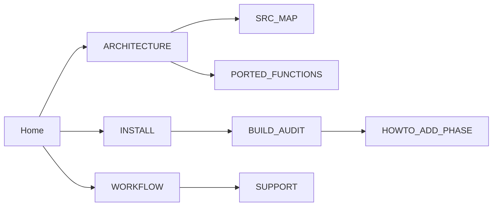

# CS2-P2C-TEMPLATES Wiki

**[EN](#english) · [RU / Русский](#русский)**

---

## English

### Overview
Wiki landing page for `CS2-P2C-TEMPLATES`. The repository ports reverse-engineered
Counter-Strike 2 research payloads from the VMProtect-protected `FuckVacAgain.dll`
and from `NLinjector.exe`. Every page here documents one module, one workflow, or
one reference table. Research, education, and bug-bounty use only.

### Files
| File                                | Purpose                                     |
|-------------------------------------|---------------------------------------------|
| `docs/wiki/Home.md`                 | This landing page and page index            |
| `docs/wiki/ARCHITECTURE.md`         | Cross-module wiring: DLL, drivers, injector |
| `docs/wiki/INSTALL.md`              | Toolchain, SDK, and depot prerequisites     |
| `docs/wiki/WORKFLOW.md`             | Inject / monitor / unload loop              |
| `docs/wiki/BUILD_AUDIT.md`          | CMake targets and artefact hashes           |
| `docs/wiki/SRC_MAP.md`              | Source tree walk, one entry per folder      |
| `docs/wiki/PORTED_FUNCTIONS.md`     | FVA symbol to `src/` mapping table          |
| `docs/wiki/HOWTO_ADD_PHASE.md`      | Guide for adding a new spoof phase          |
| `docs/wiki/SUPPORT.md`              | Diagnostic checklist for broken injects     |
| `docs/wiki/README.md`               | Folder readme, mirrors this index           |
| `wiki/en/`, `wiki/ru/`              | Sibling numbered wiki (00-10)               |

### Page index
| Page                                                 | Topic                                     |
|------------------------------------------------------|-------------------------------------------|
| [ARCHITECTURE](ARCHITECTURE.md)                      | Module graph and per-tick data flow       |
| [INSTALL](INSTALL.md)                                | Prerequisites, submodules, WDK, depots    |
| [WORKFLOW](WORKFLOW.md)                              | Live testing pipeline (P3)                |
| [BUILD_AUDIT](BUILD_AUDIT.md)                        | Build targets, output layout, hashes      |
| [SRC_MAP](SRC_MAP.md)                                | `source/` tree, one row per folder        |
| [PORTED_FUNCTIONS](PORTED_FUNCTIONS.md)              | FVA sub_* to VLB `src/hooks/` mapping     |
| [HOWTO_ADD_PHASE](HOWTO_ADD_PHASE.md)                | Extend the Section-J emit pipeline        |
| [SUPPORT](SUPPORT.md)                                | Broken inject checklist and log triage    |
| [../wiki/en/00_index.md](..\..\wiki\00_index.md)  | Numbered EN wiki entry point              |
| [../wiki/ru/00_index.md](..\..\wiki\00_index.md)  | Numbered RU wiki entry point              |

### Architecture

### Reading order
| Step | Page                                    | Goal                                  |
|-----:|-----------------------------------------|---------------------------------------|
|    1 | [INSTALL](INSTALL.md)                   | Toolchain, submodules, depot download |
|    2 | [BUILD_AUDIT](BUILD_AUDIT.md)           | Produce `fva_recon.dll` and drivers   |
|    3 | [WORKFLOW](WORKFLOW.md)                 | Inject, monitor, unload                |
|    4 | [ARCHITECTURE](ARCHITECTURE.md)         | Understand hook topology              |
|    5 | [PORTED_FUNCTIONS](PORTED_FUNCTIONS.md) | Cross-check against FVA source        |
|    6 | [HOWTO_ADD_PHASE](HOWTO_ADD_PHASE.md)   | Extend the payload                    |

### Constraints
- Depots supported: `14167` (baseline) and `24134959` (live).
- Scope: `-insecure` local dedicated servers and CTF only. Never against Valve live servers.
- Kernel drivers load in memory only. Unload requires a Windows reboot.
- Verification is live-inject plus log tail. No unit tests are provided or accepted.
- Research, education, and bug-bounty use only. No distribution of built artefacts.

---

## Русский

### Обзор
Стартовая страница вики репозитория `CS2-P2C-TEMPLATES`. Репозиторий портирует
reverse-engineered payload'ы Counter-Strike 2 из VMProtect-обфусцированной
`FuckVacAgain.dll` и из `NLinjector.exe`. Каждая страница здесь описывает один
модуль, один workflow или одну справочную таблицу. Только research, education
и bug-bounty.

### Файлы
| Файл                                | Назначение                                  |
|-------------------------------------|---------------------------------------------|
| `docs/wiki/Home.md`                 | Эта стартовая страница и индекс             |
| `docs/wiki/ARCHITECTURE.md`         | Связка DLL, драйверов и injector'а          |
| `docs/wiki/INSTALL.md`              | Toolchain, SDK, depot prerequisites         |
| `docs/wiki/WORKFLOW.md`             | Цикл inject / monitor / unload              |
| `docs/wiki/BUILD_AUDIT.md`          | CMake targets и хэши артефактов             |
| `docs/wiki/SRC_MAP.md`              | Обход `source/`, одна строка на папку       |
| `docs/wiki/PORTED_FUNCTIONS.md`     | Таблица FVA symbol → `src/`                 |
| `docs/wiki/HOWTO_ADD_PHASE.md`      | Гайд по добавлению новой spoof phase        |
| `docs/wiki/SUPPORT.md`              | Диагностический чек-лист по инжектам        |
| `docs/wiki/README.md`               | README папки, зеркалит этот индекс          |
| `wiki/en/`, `wiki/ru/`              | Сестринская нумерованная вики (00-10)       |

### Индекс страниц
| Страница                                             | Тема                                      |
|------------------------------------------------------|-------------------------------------------|
| [ARCHITECTURE](ARCHITECTURE.md)                      | Граф модулей и per-tick data flow         |
| [INSTALL](INSTALL.md)                                | Prerequisites, submodules, WDK, depots    |
| [WORKFLOW](WORKFLOW.md)                              | Live testing pipeline (P3)                |
| [BUILD_AUDIT](BUILD_AUDIT.md)                        | Build targets, layout, хэши               |
| [SRC_MAP](SRC_MAP.md)                                | Дерево `source/`, одна строка на папку    |
| [PORTED_FUNCTIONS](PORTED_FUNCTIONS.md)              | FVA sub_* → VLB `src/hooks/`              |
| [HOWTO_ADD_PHASE](HOWTO_ADD_PHASE.md)                | Расширение Section-J emit                 |
| [SUPPORT](SUPPORT.md)                                | Чек-лист сломанного inject'а              |
| [../wiki/en/00_index.md](..\..\wiki\00_index.md)  | Точка входа нумерованной EN-вики          |
| [../wiki/ru/00_index.md](..\..\wiki\00_index.md)  | Точка входа нумерованной RU-вики          |

### Архитектура

### Порядок чтения
| Шаг | Страница                                | Цель                                  |
|----:|-----------------------------------------|---------------------------------------|
|   1 | [INSTALL](INSTALL.md)                   | Toolchain, submodules, depot download |
|   2 | [BUILD_AUDIT](BUILD_AUDIT.md)           | Собрать `fva_recon.dll` и драйверы    |
|   3 | [WORKFLOW](WORKFLOW.md)                 | Inject, monitor, unload               |
|   4 | [ARCHITECTURE](ARCHITECTURE.md)         | Понять топологию hook'ов              |
|   5 | [PORTED_FUNCTIONS](PORTED_FUNCTIONS.md) | Сверить с FVA source                  |
|   6 | [HOWTO_ADD_PHASE](HOWTO_ADD_PHASE.md)   | Расширить payload                     |

### Ограничения
- Поддерживаемые depot: `14167` (baseline) и `24134959` (live).
- Область: `-insecure` local dedicated servers и CTF. Никогда против боевых серверов Valve.
- Kernel-драйверы загружаются только в память. Выгрузка требует перезагрузки Windows.
- Верификация — live inject плюс log tail. Unit-тесты не предоставляются и не принимаются.
- Только research, education и bug-bounty. Распространение собранных артефактов запрещено.
