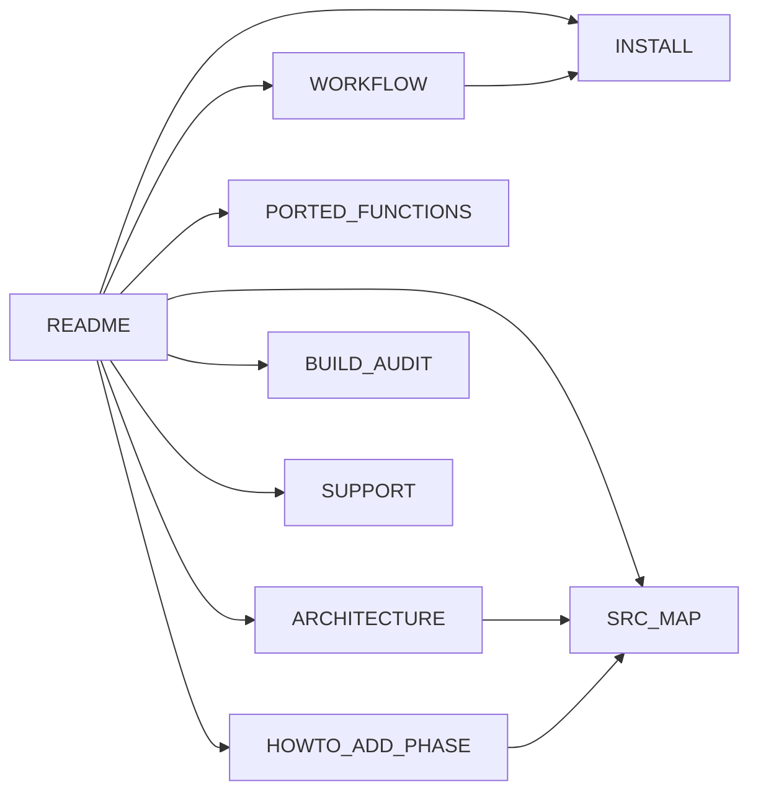
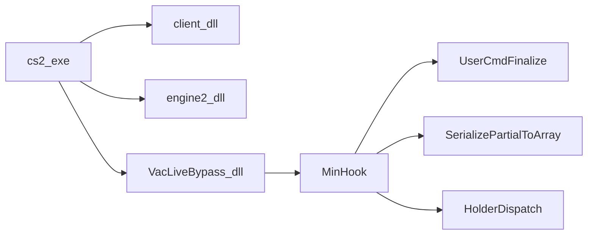

# wiki — VacLiveBypass reverse & re-implementation


**[EN](#english) · [RU / Русский](#русский)**

---

## English

### Overview
Central wiki for the VacLiveBypass DLL — the 1:1 re-implementation of the
VMProtect-obfuscated FuckVacAgain payload that mutates `CBaseUserCmdPB`
sub-tick view-angle history before wire serialization. This folder is the
navigation index for every wiki page. It is research and bug-bounty material
only.

### Files
| File                     | Purpose                                       |
|--------------------------|-----------------------------------------------|
| `README.md`              | This index                                    |
| `ARCHITECTURE.md`        | End-to-end module layout and 13-phase pipeline|
| `BUILD_AUDIT.md`         | CMake / MSBuild audit trail per artefact      |
| `HOWTO_ADD_PHASE.md`     | Adding a new mutation phase                   |
| `INSTALL.md`             | Full install + run + troubleshoot guide       |
| `PORTED_FUNCTIONS.md`    | Per-function RVA / decomp reference           |
| `SRC_MAP.md`             | `.inc` chain map for `dllmain.cpp`            |
| `SUPPORT.md`             | Donations                                     |
| `WORKFLOW.md`            | Build, inject, trace, crash-diagnose flow     |

### Build
The wiki itself is Markdown, no build. Build the code the wiki documents:

```powershell
cd source\dlls\VacLiveBypass
cmake -S . -B build -A x64 -DFVA_GATE_MODE=attack
cmake --build build --config Release --target fva_recon
```

Full multi-depot flow is in `INSTALL.md`.

### Runtime
Navigation table — pick by goal:

| Goal                                            | Read first                        |
|-------------------------------------------------|-----------------------------------|
| Install / run / troubleshoot                    | `INSTALL.md`                      |
| Understand the end-to-end DLL behaviour         | `ARCHITECTURE.md`                 |
| Build, inject, tail trace                       | `WORKFLOW.md`                     |
| Locate a specific RVA / decompiled function     | `PORTED_FUNCTIONS.md`             |
| Navigate the `.inc` source chain                | `SRC_MAP.md`                      |
| Add a new mutation phase                        | `HOWTO_ADD_PHASE.md`              |
| Audit the build artefacts                       | `BUILD_AUDIT.md`                  |
| Donate                                          | `SUPPORT.md`                      |

### Architecture
Wiki topology — each page is a leaf owned by one concern:



Documented DLL runtime layers, mirrored in `ARCHITECTURE.md`:



### Constraints
- Depot compatibility: `14167` baseline, `24134959` live. RVAs live in
  `source/dlls/VacLiveBypass/src/version_manifest.h`.
- Anti-cheat scope: VAC-adjacent research only. Never against Valve live
  servers.
- Unload: press `END` in the CS2 window; kernel driver unloads on Windows
  reboot only.
- Wiki parity: every fact must exist in both language halves. Drift is a bug.
- Research / education / bug-bounty use only.

---

## Русский

### Обзор
Центральный wiki для DLL VacLiveBypass — 1:1 реимплементации VMProtect-
обфусцированного FuckVacAgain, которая мутирует sub-tick view-angle историю в
`CBaseUserCmdPB` до wire-сериализации. Эта папка — навигационный индекс
каждой wiki-страницы. Материал только для research / bug-bounty.

### Файлы
| Файл                     | Назначение                                     |
|--------------------------|------------------------------------------------|
| `README.md`              | Этот индекс                                    |
| `ARCHITECTURE.md`        | End-to-end раскладка + 13-фазовый pipeline     |
| `BUILD_AUDIT.md`         | Аудит CMake / MSBuild по каждому артефакту     |
| `HOWTO_ADD_PHASE.md`     | Добавление новой mutation phase                |
| `INSTALL.md`             | Полная инструкция установки + запуска          |
| `PORTED_FUNCTIONS.md`    | Reference по RVA / декомпилу каждой функции    |
| `SRC_MAP.md`             | Карта `.inc` цепочки `dllmain.cpp`             |
| `SUPPORT.md`             | Донаты                                         |
| `WORKFLOW.md`            | Build, inject, trace, crash-diagnose flow      |

### Сборка
Сам wiki — Markdown, сборка не нужна. Сборка кода, который wiki документирует:

```powershell
cd source\dlls\VacLiveBypass
cmake -S . -B build -A x64 -DFVA_GATE_MODE=attack
cmake --build build --config Release --target fva_recon
```

Полный multi-depot flow — в `INSTALL.md`.

### Runtime
Навигационная таблица — выбирай по цели:

| Цель                                              | Читать первым                    |
|---------------------------------------------------|----------------------------------|
| Установить / запустить / чинить                   | `INSTALL.md`                     |
| Понять, что DLL делает end-to-end                 | `ARCHITECTURE.md`                |
| Собрать, инжектнуть, читать trace                 | `WORKFLOW.md`                    |
| Найти конкретный RVA / декомпил функции           | `PORTED_FUNCTIONS.md`            |
| Пройтись по `.inc` цепочке исходников             | `SRC_MAP.md`                     |
| Добавить новую mutation phase                     | `HOWTO_ADD_PHASE.md`             |
| Проверить build-артефакты                         | `BUILD_AUDIT.md`                 |
| Задонатить                                        | `SUPPORT.md`                     |

### Архитектура
Топология wiki — каждая страница leaf, владеет одной темой:


Runtime слои DLL, зеркальные `ARCHITECTURE.md`:


### Ограничения
- Depot compatibility: `14167` baseline, `24134959` live. RVA живут в
  `source/dlls/VacLiveBypass/src/version_manifest.h`.
- Anti-cheat scope: VAC-adjacent research. Никогда не для боевых серверов
  Valve.
- Выгрузка: `END` в окне CS2; kernel driver выгружается только при перезагрузке
  Windows.
- Парность wiki: каждый факт должен существовать в обоих языковых половинах.
  Drift — баг.
- Research / education / bug-bounty use only.
