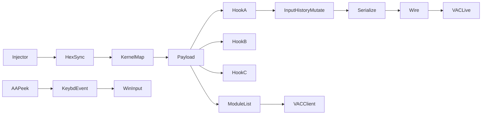
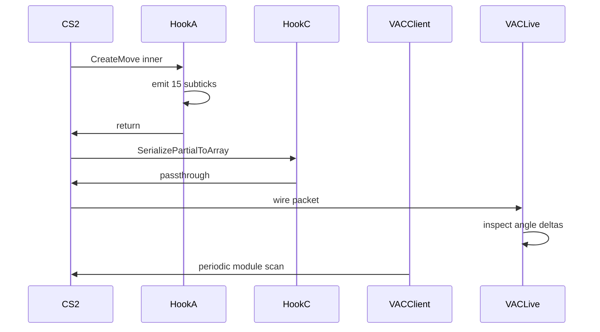

# Threat-Model

**[EN](#english) · [RU / Русский](#русский)**

---

## English

### Overview
Enumerates what VAC-Live and the client-side VAC scanner can observe when
this repository's components are active, and states the mitigation chosen
per surface. Scope is `fva_recon.dll`, `CS2UnifiedInjector`, the four
kernel drivers, and `AA_PeekOverride`. This is a static claim ledger,
not a bypass guarantee.

### Files
| File                                              | Purpose                             |
|---------------------------------------------------|-------------------------------------|
| `source/dlls/VacLiveBypass/src/hooks/`            | 3 MinHook detours on `client.dll`   |
| `source/dlls/VacLiveBypass/src/version_manifest.h`| Per-depot RVA table                 |
| `source/tools/CS2UnifiedInjector/`                | 11 inject methods                   |
| `source/drivers/CS2HexSyncCompatDriver/`          | Kernel injector driver              |
| `source/dlls/AA_PeekOverride/src/input.cpp`       | `keybd_event` press with FG guard   |
| `third_party/KDU/`                                | Vulnerable-driver DSE toggle        |
| `build/kit_vlb_default/Launch-Inject.bat`       | 12-step DSE-off / inject / restore  |

### Build
No build target. Threat model is prose. Component builds live in each
project's own README.

### Runtime
Threat-surface ledger. `Anti-Cheat View` names what the AC can observe;
`Our Surface` names the concrete artefact; `Mitigation` names what the
repo actually does about it.

| Anti-Cheat View                    | Our Surface                             | Mitigation                                          |
|------------------------------------|-----------------------------------------|-----------------------------------------------------|
| Wire-level angle deltas (VAC-Live) | `CBaseUserCmdPB.input_history` mutation | 1:1 port of FVA formula; matches pro-demo pattern   |
| Loaded module list (PEB)           | `fva_recon.dll` load event              | Kernel-mode inject via HexSync driver               |
| MinHook trampolines in `client.dll`| Hook A / B / C detours (5-byte JMP)     | Detours placed at inner helpers, not exported syms  |
| SetWindowsHookEx registration      | None                                    | Not used; injector method `sethook` disabled by default |
| Global keyboard event stream       | `keybd_event` in `AA_PeekOverride`      | Foreground guard on PRESS; unconditional RELEASE    |
| Driver service registry key        | HexSync / KillTrigger / RankSpoofer     | KDU `-map` — no `sc create`, no persistent key      |
| DSE (Driver Signature Enforcement) | KDU disables g_CiOptions                | Restore on same launcher step before returning      |
| PatchGuard integrity               | None (no SSDT/MSR hook)                 | Only IRP + IOCTL dispatch, no kernel patching       |
| Process open handle (ObRegister)   | Injector `OpenProcess` PROCESS_ALL      | Kernel-mode path skips usermode handle entirely     |
| Foreground-window telemetry        | Injector spawns from `Launch-Inject.bat`| Console runs elevated; cs2 stays focused throughout |
| Timing / tick-rate outliers        | Section-J 15-subtick emit per tick      | Emit inside `CreateMove` frame, not on side thread  |
| Module code-integrity scan (VAC)   | `fva_recon.dll` unsigned pages          | Manual-map option strips PE header; kernel map preferred |

Detour anchors — the 3 MinHook targets that make VAC-Live visible:

| Hook | Symbol                          | Detection risk                     | Mitigation                          |
|------|---------------------------------|------------------------------------|-------------------------------------|
| A    | `CBaseUserCmd::CreateMove` inner| High — hot path, per-tick          | Inner helper (`sub_...9D8C`), not export |
| B    | `IGameSystem::LevelInit`        | Low — cold path, once per map      | Detour resides in caller frame only |
| C    | `CBaseUserCmdPB::SerializePartialToArray` | Medium — wire boundary   | Read-only trampoline, no mutation on wire |

Kernel driver posture — every `.sys` in `source/drivers/` is loaded via
`kdu.exe -map`. Consequences:

| Property                | Value                                    |
|-------------------------|------------------------------------------|
| Registry `Services\*`   | Absent                                   |
| `PsLoadedModuleList`    | Absent (manual PE map)                   |
| `MmUnloadedDrivers`     | Absent (no formal unload)                |
| Unload trigger          | Reboot only                              |
| PiDDBCache entry        | Cleared by KDU                           |

### Architecture
Data-flow view of what the AC sees versus what our components emit:

Per-tick sequence — where each observer can see us:

### Constraints
- Depot compatibility: `14167` baseline and `24134959` live. Other depots
  require regenerating `version_manifest.h`.
- Anti-cheat scope: VAC and VAC-Live only. Not tested against FACEIT AC,
  ESEA, or third-party kernel AC. Never against live Valve competitive
  match-making — bug-bounty and offline research only.
- KDU-mapped drivers unload on reboot only. No graceful shutdown path.
- Foreground guard on `AA_PeekOverride` is a heuristic; alt-tabbing
  under a race window can still leak a `KEYUP` to another window.
- Every mitigation is descriptive of current code state, not a claim of
  undetectability. Research / education / bug-bounty use.

---

## Русский

### Обзор
Перечисляет что VAC-Live и клиентский сканер VAC могут наблюдать когда
компоненты этого репозитория активны, и фиксирует выбранную mitigation
по каждой surface. Scope — `fva_recon.dll`, `CS2UnifiedInjector`, четыре
kernel драйвера, и `AA_PeekOverride`. Это статический ledger заявлений,
не гарантия bypass'а.

### Файлы
| Файл                                              | Назначение                          |
|---------------------------------------------------|-------------------------------------|
| `source/dlls/VacLiveBypass/src/hooks/`            | 3 MinHook detour на `client.dll`    |
| `source/dlls/VacLiveBypass/src/version_manifest.h`| Per-depot RVA таблица               |
| `source/tools/CS2UnifiedInjector/`                | 11 методов инжекта                  |
| `source/drivers/CS2HexSyncCompatDriver/`          | Kernel injector driver              |
| `source/dlls/AA_PeekOverride/src/input.cpp`       | `keybd_event` press с FG guard      |
| `third_party/KDU/`                                | DSE-toggle через уязвимый драйвер   |
| `build/kit_vlb_default/Launch-Inject.bat`       | 12-step DSE-off / inject / restore  |

### Сборка
Нет build target. Threat model — проза. Сборка компонентов — в README
каждого проекта.

### Runtime
Ledger threat-surface. `Anti-Cheat View` — что AC может наблюдать;
`Our Surface` — конкретный artefact; `Mitigation` — что repo реально
с этим делает.

| Anti-Cheat View                    | Our Surface                             | Mitigation                                          |
|------------------------------------|-----------------------------------------|-----------------------------------------------------|
| Wire angle deltas (VAC-Live)       | `CBaseUserCmdPB.input_history` мутация  | 1:1 port FVA формулы; совпадает с pro-demo pattern  |
| Loaded module list (PEB)           | `fva_recon.dll` load event              | Kernel-mode инжект через HexSync driver             |
| MinHook trampolines в `client.dll` | Hook A / B / C detours (5-byte JMP)     | Detour на inner helper, не на экспортируемых sym    |
| SetWindowsHookEx registration      | Нет                                     | Не используется; метод `sethook` disabled by default|
| Global keyboard event stream       | `keybd_event` в `AA_PeekOverride`       | Foreground guard на PRESS; unconditional RELEASE    |
| Driver service registry key        | HexSync / KillTrigger / RankSpoofer     | KDU `-map` — нет `sc create`, нет persistent key    |
| DSE (Driver Signature Enforcement) | KDU выключает g_CiOptions               | Restore на том же шаге launcher до return           |
| PatchGuard integrity               | Нет (нет SSDT/MSR hook)                 | Только IRP + IOCTL dispatch, нет kernel patching    |
| Process open handle (ObRegister)   | Инжектор `OpenProcess` PROCESS_ALL      | Kernel-mode path обходит usermode handle полностью  |
| Foreground-window telemetry        | Инжектор запускается из `Launch-Inject.bat`| Консоль elevated; cs2 остаётся focused             |
| Timing / tick-rate outliers        | Section-J 15-subtick emit per tick      | Emit внутри `CreateMove` frame, не на side thread   |
| Module code-integrity scan (VAC)   | `fva_recon.dll` unsigned pages          | Manual-map опция strip'ает PE header; kernel map предпочтителен |

Detour anchors — 3 MinHook target, которые делают VAC-Live visible:

| Hook | Symbol                          | Detection risk                     | Mitigation                          |
|------|---------------------------------|------------------------------------|-------------------------------------|
| A    | `CBaseUserCmd::CreateMove` inner| Высокий — hot path, per-tick       | Inner helper (`sub_...9D8C`), не export |
| B    | `IGameSystem::LevelInit`        | Низкий — cold path, once per map   | Detour живёт только в caller frame  |
| C    | `CBaseUserCmdPB::SerializePartialToArray` | Средний — wire boundary  | Read-only trampoline, нет мутации на wire |

Kernel driver posture — каждый `.sys` из `source/drivers/` загружается
через `kdu.exe -map`. Consequences:

| Property                | Value                                    |
|-------------------------|------------------------------------------|
| Registry `Services\*`   | Отсутствует                              |
| `PsLoadedModuleList`    | Отсутствует (manual PE map)              |
| `MmUnloadedDrivers`     | Отсутствует (нет formal unload)          |
| Unload trigger          | Только reboot                            |
| PiDDBCache entry        | Очищается KDU                            |

### Архитектура
Data-flow view — что видит AC vs что излучают компоненты:

Per-tick sequence — где каждый observer нас видит:

### Ограничения
- Depot compatibility: `14167` baseline и `24134959` live. Другие depot
  требуют регенерации `version_manifest.h`.
- Anti-cheat scope: только VAC и VAC-Live. Не тестировалось против
  FACEIT AC, ESEA, или third-party kernel AC. Никогда против live
  Valve соревновательного match-making — bug-bounty и offline research.
- KDU-mapped драйверы выгружаются только при reboot. Нет graceful
  shutdown пути.
- Foreground guard в `AA_PeekOverride` — эвристика; alt-tab под race
  window всё ещё может leak'нуть `KEYUP` в другое окно.
- Каждая mitigation описывает текущее состояние кода, не заявление о
  необнаружимости. Research / education / bug-bounty.
