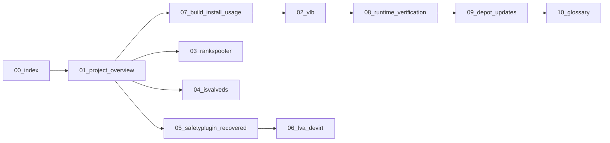

# CS2-P2C-TEMPLATES Wiki — English


**[EN](#english) · [RU / Русский](#русский)**

---

## English

### Overview
English mirror of the CS2-P2C-TEMPLATES wiki. Eleven numbered chapters cover the three products (VacLiveBypass, RankSpoofer, IsValveDS), the reference reconstruction (SafetyPlugin_recovered), the VMP analyzer (fva_devirt), and the shared build/install/verify/depot-update workflow. The Russian mirror lives in `../ru/`.

### Files
| File                                     | Purpose                                                       |
|------------------------------------------|---------------------------------------------------------------|
| `00_index.md`                            | Chapter index, reading order, repo map, version snapshot     |
| `01_project_overview.md`                 | Three products at a glance + tooling table + legal boundary   |
| `02_vlb.md`                              | VacLiveBypass: 4 hooks, gate byte, Section-J emitter         |
| `03_rankspoofer.md`                      | RankSpoofer driver + VT100 console                            |
| `04_isvalveds.md`                        | `m_bIsValveDS` one-byte spoofer (driver + console)            |
| `05_safetyplugin_recovered.md`           | Pseudo-C reconstruction of FVA (13 files, 1332 lines)         |
| `06_fva_devirt.md`                       | Standalone C++ VMP static analyzer                            |
| `07_build_install_usage.md`              | 12 projects, kit unpack, launcher scripts                     |
| `08_runtime_verification.md`             | `scripts/runtime_verify/` H1–H4 live-memory pipeline          |
| `09_depot_updates.md`                    | Surviving CS2 patches: autofetch, SHA whitelist, sig-scan     |
| `10_glossary.md`                         | Terminology                                                   |

### Build
Chapters are plain markdown. GitHub renders them in place. To view locally:

```powershell
cd wiki\en
Get-ChildItem *.md | Select-Object Name, Length
```

Cross-references use repo-relative paths. Open the index first:

```powershell
code wiki\en\00_index.md
```

### Runtime
Snapshot of the depot state documented across chapters. Source: `docs/RELEASE_NOTES_v1.15-claude.md`, verified live 2026-07-16.

| Hook | Symbol                          | Module              |     RVA (14170) |
|------|---------------------------------|---------------------|----------------:|
| H1   | `CBaseUserCmd::CreateMove`      | client.dll          |      `0xB09528` |
| H2   | `IGameSystem::LevelInit`        | client.dll          |      `0xB3A600` |
| H3   | `SerializePartialToArray`       | client.dll          |     `0x11AD520` |
| H4   | `ShouldUpdateSequences`         | animationsystem.dll |      `0x14F950` |

| Field              | Value                                                       |
|--------------------|-------------------------------------------------------------|
| CS2 build number   | `14170` (also verified on `14169`)                          |
| Depot ID           | `24134959` (baseline `14167` kept for regression)           |
| VLB gate modes     | `attack` (fire-only) or `byte` (always-on)                  |
| Verification date  | 2026-07-16 (live memory read)                               |

### Architecture
Reading order across the 11 chapters:



<details>
<summary>Full chapter cross-reference</summary>

| # | Chapter                        | Depends on         |
|---|--------------------------------|--------------------|
| 00 | Index                         | —                  |
| 01 | Project overview              | 00                 |
| 02 | VacLiveBypass                 | 01, 07             |
| 03 | RankSpoofer                   | 01                 |
| 04 | IsValveDS                     | 01                 |
| 05 | SafetyPlugin_recovered        | 02                 |
| 06 | fva_devirt                    | 05                 |
| 07 | Build / install / usage       | 01                 |
| 08 | Runtime verification          | 02, 07             |
| 09 | Depot updates                 | 07, 08             |
| 10 | Glossary                      | any                |

</details>

### Constraints
- Windows 10/11 x64 only. Depots `24134959` (live) and `14167` (regression baseline).
- Never against Valve live servers. Testing scope: `-insecure` local dedicated server, CTF, private CS2 mods.
- Kernel drivers load via `kdu.exe -map` (65 embedded vulnerable providers); unload on reboot only.
- Research / education / bug-bounty use. See `../../LICENSE` and `../../docs/ETHICS.md`.

---

## Русский

### Обзор
Английское зеркало вики CS2-P2C-TEMPLATES. Одиннадцать нумерованных глав покрывают три продукта (VacLiveBypass, RankSpoofer, IsValveDS), эталонную реконструкцию (SafetyPlugin_recovered), VMP-анализатор (fva_devirt) и общий workflow сборка/установка/верификация/обновление депо. Русское зеркало — в `../ru/`.

### Файлы
| Файл                                     | Назначение                                                    |
|------------------------------------------|---------------------------------------------------------------|
| `00_index.md`                            | Индекс глав, порядок чтения, карта репо, срез версии          |
| `01_project_overview.md`                 | Три продукта + tooling + правовые границы                     |
| `02_vlb.md`                              | VacLiveBypass: 4 хука, гейт-байт, эмиттер Section-J           |
| `03_rankspoofer.md`                      | Драйвер RankSpoofer + VT100-консоль                           |
| `04_isvalveds.md`                        | Однобайтовый спуфер `m_bIsValveDS` (драйвер + консоль)        |
| `05_safetyplugin_recovered.md`           | Псевдо-C реконструкция FVA (13 файлов, 1332 строки)           |
| `06_fva_devirt.md`                       | Standalone C++ статический анализатор VMP                     |
| `07_build_install_usage.md`              | 12 проектов, распаковка kit, launcher-скрипты                 |
| `08_runtime_verification.md`             | `scripts/runtime_verify/` live-пруф H1–H4                     |
| `09_depot_updates.md`                    | Как пережить патчи CS2: autofetch, SHA-whitelist, sig-scan    |
| `10_glossary.md`                         | Терминология                                                  |

### Сборка
Главы — обычный markdown. GitHub рендерит их напрямую. Локальный просмотр:

```powershell
cd wiki\en
Get-ChildItem *.md | Select-Object Name, Length
```

Кросс-ссылки — repo-relative. Начать с индекса:

```powershell
code wiki\en\00_index.md
```

### Runtime
Срез состояния депо, задокументированный в главах. Источник: `docs/RELEASE_NOTES_v1.15-claude.md`, верифицировано live 2026-07-16.

| Hook | Symbol                          | Module              |     RVA (14170) |
|------|---------------------------------|---------------------|----------------:|
| H1   | `CBaseUserCmd::CreateMove`      | client.dll          |      `0xB09528` |
| H2   | `IGameSystem::LevelInit`        | client.dll          |      `0xB3A600` |
| H3   | `SerializePartialToArray`       | client.dll          |     `0x11AD520` |
| H4   | `ShouldUpdateSequences`         | animationsystem.dll |      `0x14F950` |

| Поле               | Значение                                                    |
|--------------------|-------------------------------------------------------------|
| Номер сборки CS2   | `14170` (также проверено на `14169`)                        |
| Depot ID           | `24134959` (baseline `14167` оставлен для регрессии)        |
| Режимы гейта VLB   | `attack` (только по выстрелу) или `byte` (always-on)        |
| Дата верификации   | 2026-07-16 (чтение живой памяти)                            |

### Архитектура
Порядок чтения глав:


<details>
<summary>Полная таблица зависимостей глав</summary>

| # | Глава                          | Зависит от         |
|---|--------------------------------|--------------------|
| 00 | Индекс                        | —                  |
| 01 | Обзор проекта                 | 00                 |
| 02 | VacLiveBypass                 | 01, 07             |
| 03 | RankSpoofer                   | 01                 |
| 04 | IsValveDS                     | 01                 |
| 05 | SafetyPlugin_recovered        | 02                 |
| 06 | fva_devirt                    | 05                 |
| 07 | Сборка / установка / usage    | 01                 |
| 08 | Runtime-верификация           | 02, 07             |
| 09 | Обновления депо               | 07, 08             |
| 10 | Глоссарий                     | any                |

</details>

### Ограничения
- Только Windows 10/11 x64. Депо `24134959` (live) и `14167` (regression baseline).
- Никогда против live-серверов Valve. Область тестирования: `-insecure` локальный dedicated, CTF, приватные CS2-моды.
- Kernel-драйверы грузятся через `kdu.exe -map` (65 embedded vulnerable providers); выгрузка только при перезагрузке.
- Research / education / bug-bounty. См. `../../LICENSE` и `../../docs/ETHICS.md`.
